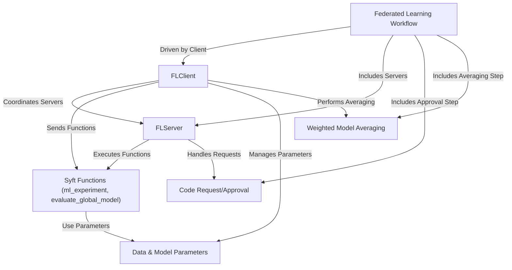
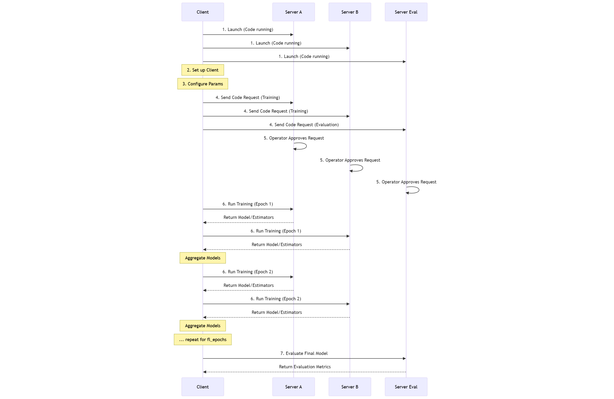
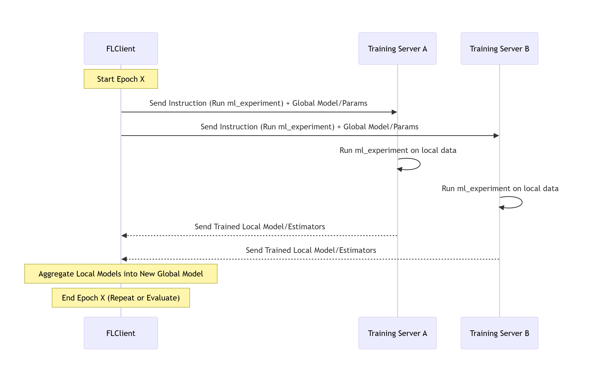
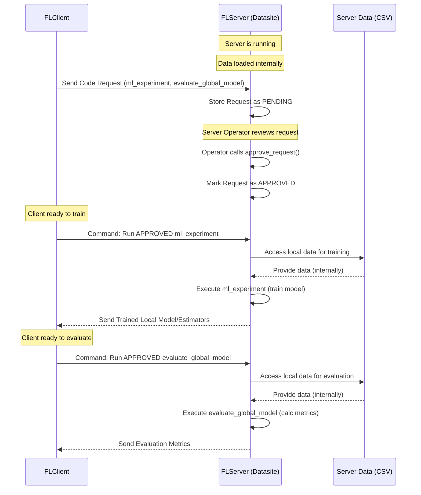
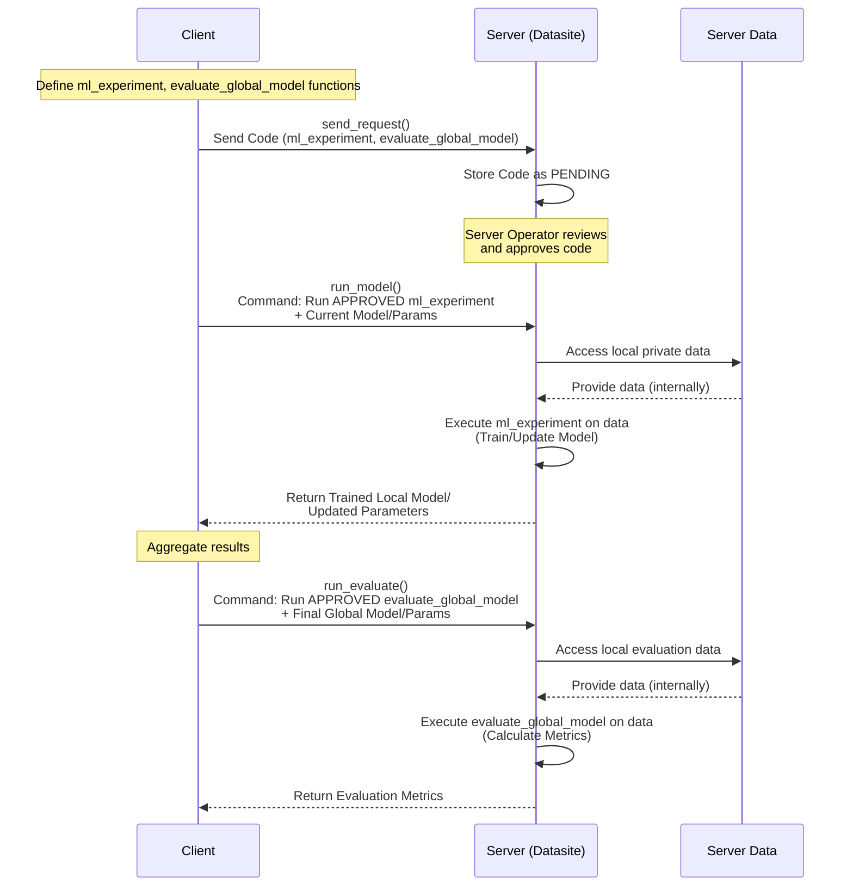
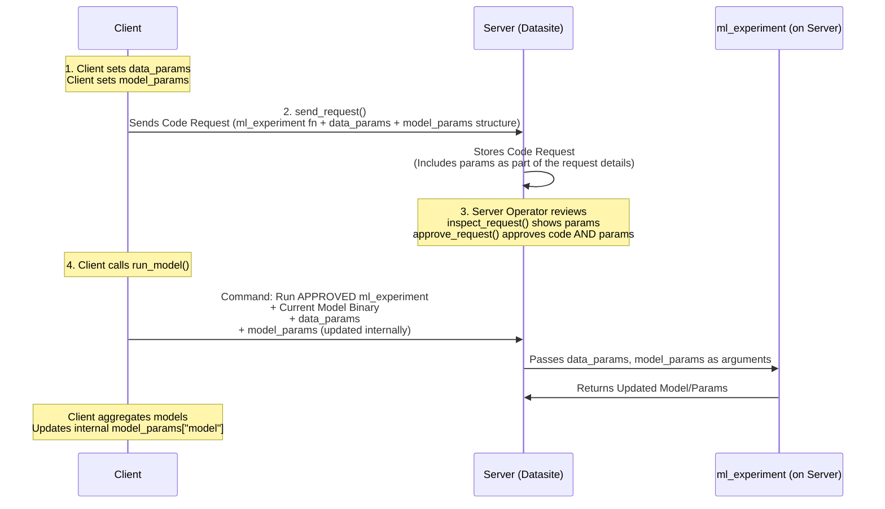
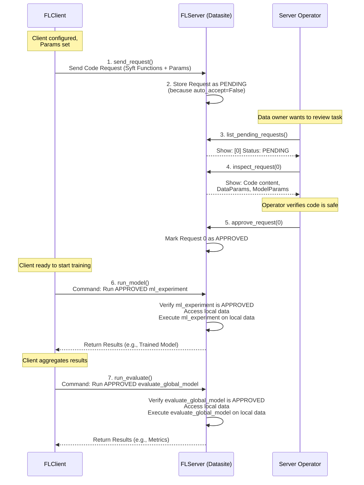
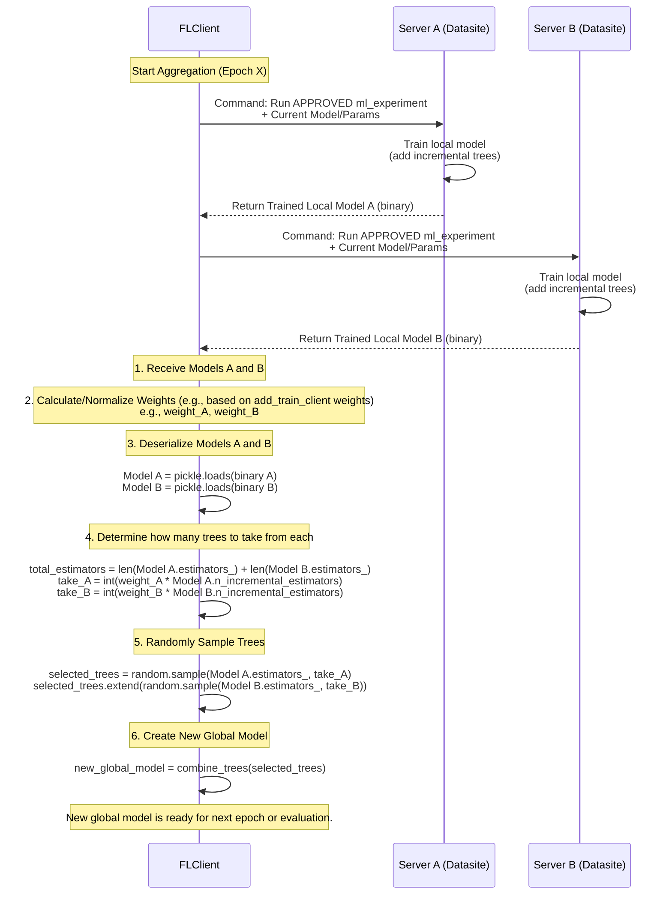

# Federated-learning-with-Random-Forests

© 2025 AISeed. All rights reserved.

## Visual Overview




## Chapters

1. [Federated Learning Workflow
](Chapter_1:_Federated_Learning_Workflow)
2. [FLClient
](02_flclient_.md)
3. [FLServer
](03_flserver_.md)
4. [Syft Functions (ml_experiment, evaluate_global_model)
](04_syft_functions__ml_experiment__evaluate_global_model__.md)
5. [Data & Model Parameters
](05_data___model_parameters_.md)
6. [Code Request/Approval
](06_code_request_approval_.md)
7. [Weighted Model Averaging
](07_weighted_model_averaging_.md)

---


# Chapter 1: Federated Learning Workflow

Welcome to the `fed_rf` tutorial! In this first chapter, we'll explore the complete journey of training a machine learning model using Federated Learning with this library. Think of it as the master plan or the recipe for a distributed project.

Imagine you have valuable data, like patient records in different hospitals, financial data in various banks, or sensor readings from devices spread across locations. You want to train a powerful machine learning model using *all* this data, but you absolutely *cannot* move the data from where it is due to privacy, security, or regulatory reasons.

This is where Federated Learning comes in! It allows multiple parties (like hospitals or banks) to collaboratively train a model without ever sharing their raw data. Instead, the training happens locally on their data, and only model updates or aggregated results are shared.

The `fed_rf` library helps you coordinate this process, specifically for Random Forest models. This chapter outlines the sequence of steps involved, like a multi-step project plan, to go from having distributed data to a collaboratively trained model.

Here is the overall workflow:

1.  **Launch Data Silos (Servers):** Set up the locations where the data resides and where training will happen.
2.  **Set Up the Federated Learning Client:** Initialize the central coordinator that manages the training process.
3.  **Configure Data and Model Parameters:** Define what data columns to use and how the model should be trained.
4.  **Send Requests to Servers:** The coordinator sends the training plan (code) to the data locations.
5.  **Approve Requests on Servers:** Each data location reviews and approves the plan before allowing it to run.
6.  **Run Federated Training:** The coordinator kicks off the training rounds across the approved data locations.
7.  **Evaluate the Federated Model:** Assess the performance of the final combined model.

Let's walk through each step using simple code examples from the README.

### Step 1: Launch Data Silos (Servers)

The "data silos" are essentially servers where your data lives. In the `fed_rf` world, these are instances of the `FLServer`. You'll typically have one server for each distinct dataset you want to use in training or evaluation.

```python
from fed_rf_mk.server import FLServer
import threading

# Server for the first dataset (silo1)
server1 = FLServer("silo1", 8080, "path/to/data1.csv", auto_accept=False)
server_thread1 = threading.Thread(target=server1.start, daemon=True)
server_thread1.start()

# Server for the second dataset (silo2)
server2 = FLServer("silo2", 8081, "path/to/data2.csv", auto_accept=False)
server_thread2 = threading.Thread(target=server2.start, daemon=True)
server_thread2.start()

# Server for evaluation data
server3 = FLServer("eval_silo", 8082, "path/to/eval_data.csv", auto_accept=False)
server_thread3 = threading.Thread(target=server3.start, daemon=True)
server_thread3.start()
```

In this step, we create `FLServer` objects, specifying a name, a port to listen on, and the path to the data file (a CSV in this case). We run them in separate threads so they can all run simultaneously, simulating different data locations. Setting `auto_accept=False` means the server operator must manually approve any incoming training requests, which is important for privacy (more on this in Step 5).

We'll learn more about the `FLServer` in [Chapter 3: FLServer](03_flserver_.md).

### Step 2: Set Up the Federated Learning Client

The `FLClient` acts as the central coordinator. It doesn't hold any data itself but connects to all the `FLServer` instances (which the client confusingly calls "clients" or "datasites") to orchestrate the federated process.

```python
from fed_rf_mk.client import FLClient

# Initialize the coordinator
fl_client = FLClient()

# Tell the coordinator about the training data silos
fl_client.add_train_client(
    name="silo1",
    url="http://localhost:8080",
    email="fedlearning@rf.com",
    password="your_password" # Replace with actual credentials
)
fl_client.add_train_client(
    name="silo2",
    url="http://localhost:8081",
    email="fedlearning@rf.com",
    password="your_password" # Replace with actual credentials
)

# Tell the coordinator about the evaluation data silo
fl_client.add_eval_client(
    name="eval_silo",
    url="http://localhost:8082",
    email="fedlearning@rf.com",
    password="your_password" # Replace with actual credentials
)
```

Here, we create the `FLClient` object and then use `add_train_client` and `add_eval_client` to register the servers we launched in Step 1. The `url`, `email`, and `password` are needed for the client to securely connect to each server using the underlying PySyft framework.

The `FLClient` is the focus of the next chapter: [Chapter 2: FLClient](02_flclient_.md).

### Step 3: Configure Data and Model Parameters

Before sending out the training task, the coordinator needs to specify *what* needs to be trained (the target column) and *how* the Random Forest model should be configured (number of trees, training split, etc.).

```python
# Define parameters for the data
data_params = {
    "target": "target_column",              # Name of the column we want to predict
    "ignored_columns": ["id", "timestamp"]  # Columns to ignore (e.g., identifiers)
}
fl_client.set_data_params(data_params)

# Define parameters for the model training
model_params = {
    "model": None,                  # Start without a pre-existing model
    "n_base_estimators": 100,       # How many trees in the first round
    "n_incremental_estimators": 10, # How many trees to add in later rounds
    "train_size": 0.8,              # Use 80% of local data for training
    "test_size": 0.2,               # Use 20% of local data for testing/validation
    "sample_size": None,            # Use all available samples
    "fl_epochs": 3                  # Run 3 rounds of federated learning
}
fl_client.set_model_params(model_params)
```

We define two dictionaries, `data_params` and `model_params`, containing all the necessary settings. The `FLClient` then stores these using `set_data_params` and `set_model_params`. These parameters will be sent to the servers along with the training code.

We will explore data and model parameters in more detail in [Chapter 5: Data & Model Parameters](05_data___model_parameters_.md).

### Step 4: Send Requests to Servers

Now that the client is set up and configured, it's time to send the "project plan" (the training and evaluation code) to the data silos.

```python
# Send the training and evaluation plan
fl_client.send_request()

# Check if the requests were successfully sent
fl_client.check_status_last_code_requests()
```

Calling `fl_client.send_request()` packages the necessary instructions (specifically, the Python functions `ml_experiment` for training and `evaluate_global_model` for evaluation) and sends them as "code requests" to all registered servers. The `check_status_last_code_requests()` call lets you verify that the requests were received by the servers.

The functions `ml_experiment` and `evaluate_global_model` are core components and will be covered in [Chapter 4: Syft Functions (ml_experiment, evaluate_global_model)](04_syft_functions__ml_experiment__evaluate_global_model__.md). The process of sending and checking these requests is part of [Chapter 6: Code Request/Approval](06_code_request_approval_.md).

### Step 5: Approve Requests on Servers

This is a crucial privacy and security step. The server operators (data owners) need to review the code request sent in Step 4. They want to ensure the code is safe, doesn't attempt to exfiltrate raw data, and performs the task as described. Only after explicit approval can the code run on their sensitive data.

```python
# On server1 (simulated)
print("Server 1: Checking pending requests...")
server1.list_pending_requests()  # Shows a list like: Request ID: 0, Status: PENDING
server1.inspect_request(0)       # Allows the operator to see the code and parameters
server1.approve_request(0)       # The operator approves request with ID 0

# On server2 (simulated)
print("Server 2: Approving request...")
server2.approve_request(0) # Assuming request ID is 0

# On server3 (evaluation server) (simulated)
print("Server 3: Approving request...")
server3.approve_request(0) # Assuming request ID is 0
```

Using `list_pending_requests()`, `inspect_request()`, and `approve_request()`, the server operator manually controls which code is allowed to run. This is why we set `auto_accept=False` when launching the servers.

The details of this approval process are covered in [Chapter 6: Code Request/Approval](06_code_request_approval_.md).

### Step 6: Run Federated Training

Once all the participating training servers have approved the code request, the client can initiate the actual federated training process.

```python
# Start the federated training rounds
fl_client.run_model()
```

Calling `fl_client.run_model()` orchestrates the training over several "epochs" or rounds (as defined in `model_params["fl_epochs"]`). In each round:

1.  The client sends the current global model (or instructions to build a new one in the first round) to each participating server.
2.  Each server runs the approved `ml_experiment` code locally on its own data.
3.  Each server sends back its trained model (or just the learned parameters/estimators) to the client.
4.  The client aggregates the models/estimators received from all servers into a new global model.

This cycle repeats for the specified number of epochs. The raw data *never* leaves the servers.

The aggregation process is a key part of Federated Learning, and `fed_rf` uses a specific method for Random Forests, which is explained in [Chapter 7: Weighted Model Averaging](07_weighted_model_averaging_.md).

### Step 7: Evaluate the Federated Model

After the training rounds are complete and the client has the final aggregated model, it's time to see how well it performs. This is typically done by sending the final model to an evaluation server that holds separate test data.

```python
# Run evaluation on the dedicated evaluation server
evaluation_results = fl_client.run_evaluate()
print(evaluation_results)
```

The `fl_client.run_evaluate()` method sends the final model to the server(s) designated for evaluation. These servers then run the approved `evaluate_global_model` code on their local test data and send back performance metrics (like accuracy, precision, etc.). The client then prints these results.

The `evaluate_global_model` function is part of [Chapter 4: Syft Functions (ml_experiment, evaluate_global_model)](04_syft_functions__ml_experiment__evaluate_global_model__.md).

### Putting it Together: A Simple Workflow Diagram

Here's a simplified view of the interaction flow described in the steps above:




This diagram shows how the `FLClient` orchestrates the process, sending code and commands, while the `FLServers` act on their local data and return only the necessary model components or results.

### Conclusion

In this chapter, we've seen the complete lifecycle of a federated learning task using `fed_rf`. It involves setting up the distributed data locations (`FLServer`), coordinating the process from a central point (`FLClient`), configuring the task, sending the necessary code for approval, executing the training rounds across the approved locations, and finally evaluating the resulting model.

This workflow ensures that sensitive data remains private while still allowing the collective intelligence of all data sources to contribute to a powerful shared model.

Now that we have a high-level understanding of the workflow, let's dive deeper into the main component responsible for coordinating everything: the `FLClient`.

[Next Chapter: FLClient](02_flclient_.md)

# Chapter 2: FLClient

Welcome back to the `fed_rf` tutorial! In the previous chapter, [Chapter 1: Federated Learning Workflow](01_federated_learning_workflow_.md), we got a bird's-eye view of the entire journey of training a Random Forest model using Federated Learning with `fed_rf`. We saw the major steps involved, from setting up data locations (servers) to getting the final evaluation results.

Now, let's zoom in on the central piece that makes all of this coordination possible: the `FLClient`.

### What is the FLClient?

Imagine the entire federated learning process as a grand orchestra, with different data silos (the servers we talked about in Chapter 1) being the musicians, each holding their unique instrument (their private data). The `FLClient` is the **conductor** of this orchestra.

The conductor doesn't touch any of the instruments or the sheet music held by individual musicians. Instead, the conductor has the *master score* (the overall training plan) and instructs the musicians *what* to play and *when* to play it. The conductor listens to the music produced by sections, perhaps guides them to play slightly differently, and ensures everyone plays together harmoniously to create a complete symphony (the final global model).

That's exactly what the `FLClient` does in `fed_rf`:

*   It's the main interface you interact with to start and manage the federated learning process.
*   It knows *which* data silos (servers) are participating.
*   It defines the *overall plan*: what data columns to use, what model settings to apply, and how many training rounds to run.
*   It sends *instructions* (in the form of secure code) to the data silos.
*   It orchestrates the *training rounds*, telling servers when to train and when to send back results.
*   It *combines* the results received from the servers (like merging the musical scores from different sections) to produce a better global model *without ever seeing the raw data*.

It's the brain that directs the collaborative learning effort across distributed, private datasets.

### Setting Up the Conductor: Initializing the FLClient

Your first step is always to create an instance of the `FLClient`. This is like picking up the conductor's baton.

```python
from fed_rf_mk.client import FLClient

# Create the conductor
fl_client = FLClient()
```

This simple line creates the `FLClient` object that you will use for all subsequent steps in the federated learning process. It doesn't need any special parameters when you initialize it.

### Telling the Conductor About the Musicians: Adding Data Silos

The conductor needs to know who is in the orchestra. In `fed_rf`, the `FLClient` needs to know which `FLServer` instances (data silos) it should connect to for training and evaluation. You add them using the `add_train_client` and `add_eval_client` methods.

These methods require the server's name, URL, and login credentials so the `FLClient` can securely connect using the underlying PySyft framework.

```python
# Add a training data silo
fl_client.add_train_client(
    name="silo1",
    url="http://localhost:8080", # Where the server is running
    email="fedlearning@rf.com",  # Login email
    password="your_password"     # Login password
)

# Add another training data silo
fl_client.add_train_client(
    name="silo2",
    url="http://localhost:8081",
    email="fedlearning@rf.com",
    password="your_password"
)

# Add an evaluation data silo
fl_client.add_eval_client(
    name="eval_silo",
    url="http://localhost:8082",
    email="fedlearning@rf.com",
    password="your_password"
)
```

Each call to `add_train_client` or `add_eval_client` establishes a secure connection from the `FLClient` to one specific `FLServer`. The `name` is just a label you use to refer to that server from the client side. Notice we are adding training servers and separate evaluation servers – this is common practice to ensure your model performs well on data it hasn't seen during training.

You can add as many training or evaluation clients as needed, corresponding to the `FLServer` instances you launched (as shown in Step 1 of the workflow in [Chapter 1: Federated Learning Workflow](01_federated_learning_workflow_.md)).

*(Note: The `weight` parameter in `add_train_client` is for advanced model aggregation and will be covered in [Chapter 7: Weighted Model Averaging](07_weighted_model_averaging_.md). For now, you can ignore it.)*

### Giving the Conductor the Score: Setting Data and Model Parameters

The conductor needs the master score before they can lead the orchestra. Similarly, the `FLClient` needs to know the details of the learning task: what data to use and how the model should be built and trained. This is done using `set_data_params` and `set_model_params`.

These methods take Python dictionaries containing the configuration details.

```python
# What data features/target to use
data_params = {
    "target": "outcome_column",      # Name of the column to predict
    "ignored_columns": ["id", "date"] # Columns to exclude (e.g., identifiers)
}
fl_client.set_data_params(data_params)

# How to train the Random Forest model
model_params = {
    "model": None,                  # No model yet, start from scratch
    "n_base_estimators": 50,        # Start with 50 trees in round 1
    "n_incremental_estimators": 5,  # Add 5 trees in each subsequent round
    "train_size": 0.75,             # Use 75% of local data for training
    "test_size": 0.25,              # Use 25% for local testing/validation
    "sample_size": None,            # Use all relevant rows
    "fl_epochs": 5                  # Run 5 federated learning rounds
}
fl_client.set_model_params(model_params)
```

By calling these methods, you're storing the learning configuration within the `FLClient`. This configuration will later be sent to the servers so they know exactly how to process their local data. We'll dive deeper into the meaning of each parameter in [Chapter 5: Data & Model Parameters](05_data___model_parameters_.md).

### Distributing the Music Sheets: Sending the Training Plan

Once the `FLClient` knows who the musicians are and has the score, it needs to distribute the music sheets (the code instructions) to the servers. In `fed_rf`, this is done by sending a "code request".

```python
# Send the plan (code requests) to all connected servers
fl_client.send_request()
```

Calling `send_request()` packages the predefined training and evaluation logic (`ml_experiment` and `evaluate_global_model`, which we'll explore in [Chapter 4: Syft Functions (ml_experiment, evaluate_global_model)](04_syft_functions__ml_experiment__evaluate_global_model__.md)), along with the `data_params` and `model_params`, and sends them securely to every `FLServer` that was added using `add_train_client` and `add_eval_client`.

After sending, you can check if the servers received the requests:

```python
# Check the status of the requests we just sent
fl_client.check_status_last_code_requests()
```

This method queries each server to see the status of the last code request sent by this client. It will typically show `PENDING` initially, waiting for the server operator's approval (which is covered in [Chapter 6: Code Request/Approval](06_code_request_approval_.md)).

### Conducting the Performance: Running the Federated Training

With the servers launched, connected, configured, and having approved the code request, the `FLClient` is ready to start the main performance – the federated training rounds.

```python
# Start the training symphony
fl_client.run_model()
```

This is where the real magic happens! Calling `run_model()` kicks off the iterative federated learning process defined by `model_params["fl_epochs"]`. Behind the scenes, for each epoch:

1.  The `FLClient` prepares the current global model (or instructions for the first round).
2.  It securely sends instructions to each *training* server to run the approved `ml_experiment` function using their local data and the current model/parameters.
3.  Each server executes `ml_experiment` locally. This function trains the model on the server's private data.
4.  Each server sends back its *updated model* (specifically, the new set of decision trees learned) to the `FLClient`. Crucially, the raw data *never* leaves the server.
5.  The `FLClient` collects the models/estimators from all participating servers.
6.  It aggregates these local contributions into a single, improved global model. `fed_rf` uses a weighted averaging method for this (see [Chapter 7: Weighted Model Averaging](07_weighted_model_averaging_.md)).
7.  This aggregated model becomes the starting point for the next epoch.

This process repeats for the specified number of `fl_epochs`. The `run_model()` call blocks (waits) until all epochs are complete.

### Applauding the Performance: Evaluating the Final Model

After the training rounds are finished and the `FLClient` has the final aggregated global model, the conductor needs to hear how well the complete symphony sounds. This is done by evaluating the model, typically on separate test data held by dedicated evaluation servers.

```python
# Evaluate the final model using the evaluation silos
evaluation_results = fl_client.run_evaluate()
print(evaluation_results)
```

The `run_evaluate()` method sends the final global model to the servers that were added using `add_eval_client`. These servers then execute the approved `evaluate_global_model` function locally on their test dataset. This function calculates standard machine learning metrics (like accuracy, precision, F1-score, etc.) without exposing the test data. The evaluation results are sent back to the `FLClient`, which then returns them to you.

### How the FLClient Works Under the Hood (Simplified)

Let's peek behind the curtain slightly, keeping it very beginner-friendly. The `FLClient` doesn't *do* the machine learning calculations itself. Its power comes from its ability to securely *communicate* and *orchestrate* tasks on the `FLServer`s using PySyft.

When you call methods like `run_model()` or `run_evaluate()`, the `FLClient` performs these high-level steps:

1.  **Serialization:** It takes the current global model object and the parameters (`data_params`, `model_params`) and converts them into a format that can be sent over the network (often using libraries like `pickle` or `cloudpickle`, as seen in the `client.py` and `server.py` files).
2.  **Remote Execution Request:** Using the connections established by `add_train_client` and `add_eval_client`, it sends a command to a specific server, telling it: "Run the previously approved `ml_experiment` (or `evaluate_global_model`) function using this data asset (`data=data_asset`) and these parameters (`dataParams=dataParams`, `modelParams=modelParams`)."
3.  **Waiting for Results:** The `FLClient` then waits for the server to finish executing the function.
4.  **Deserialization:** When the server sends back its result (e.g., a trained model object or evaluation metrics), the `FLClient` receives it and converts it back into usable Python objects.
5.  **Aggregation (for training):** If the result is a trained model from a training server, the `FLClient` collects these models from all participating training servers and combines them (aggregates them) into a new global model for the next round.

Here's a simplified flow for one training epoch:




This diagram shows that the `FLClient` directs the traffic but the actual computation on the data happens remotely on the servers.

Looking at the `fed_rf_mk/client.py` file, you'll see the `FLClient` class uses `syft.login` to connect to servers and then interacts with them using `datasite.code.function_name(...)`. This `datasite.code` part is how PySyft allows the client to securely call functions that were previously approved on the server.

For instance, inside `run_model()`, you see code like:

```python
# Simplified snippet from run_model
# This is where the client tells the server to run ml_experiment
modelParams = datasite.code.ml_experiment(
    data=data_asset,
    dataParams=dataParams,
    modelParams=modelParams
).get_from(datasite)
```

This line is the command from the conductor (`FLClient`) telling a specific musician (`datasite`, which represents an `FLServer`) to perform a specific piece of music (`ml_experiment`) using their instrument (`data_asset`) and the provided score details (`dataParams`, `modelParams`). The `.get_from(datasite)` part instructs PySyft to fetch the result back to the client.

Similarly, in `run_evaluate()`, the `FLClient` calls `evaluate_global_model` remotely:

```python
# Simplified snippet from run_evaluate
# Client tells the evaluation server to run the evaluation function
model = datasite.code.evaluate_global_model(
    data=data_asset, dataParams=dataParams, modelParams=modelParams
).get_from(datasite)
```

### Conclusion

The `FLClient` is your main control center for orchestrating federated learning in `fed_rf`. It's responsible for:

*   Connecting to the distributed data silos (`add_train_client`, `add_eval_client`).
*   Defining the learning task (`set_data_params`, `set_model_params`).
*   Sending the execution plan (the Syft Functions) to the servers (`send_request`).
*   Directing the training rounds (`run_model`).
*   Aggregating the results from servers (handled internally by `run_model`).
*   Initiating the final model evaluation (`run_evaluate`).

It does all of this without ever needing direct access to the sensitive data stored on the servers, truly acting as a privacy-preserving conductor for your distributed machine learning orchestra.

Now that we understand the conductor, let's look at the musicians – the `FLServer`s – in the next chapter.

# Chapter 3: FLServer

Welcome back! In the previous chapter, [Chapter 2: FLClient](02_flclient_.md), we learned about the `FLClient`, the "conductor" that orchestrates the federated learning process. It's the brain that tells everyone what to do.

Now, let's meet the other crucial players in our symphony: the `FLServer`s.

### What is the FLServer?

Imagine you're a chef with a secret family recipe and valuable ingredients in your kitchen. You want to participate in a cooking competition with other chefs, but you absolutely cannot let anyone else see your ingredients or your kitchen secrets. However, you *can* follow instructions (a recipe provided by the competition organizer) using your own ingredients in your own kitchen and send back the final dish (the baked cake, not the ingredients!).

In the `fed_rf` world, an `FLServer` is like that chef's secure kitchen.

*   It's a program that you run on a machine where your valuable, private data resides.
*   It acts as a guardian for your data.
*   It never shares the raw data with anyone, not even the `FLClient`.
*   It receives instructions (in the form of secure code called Syft Functions) from the `FLClient`.
*   It runs these instructions *locally* in its own secure environment, using its own data.
*   It sends *only* the results of the computation back to the `FLClient` (like sending the baked cake).

Think of each `FLServer` as a "data silo" or a "local expert" that can process information but keeps its raw knowledge private.

### Why Do We Need FLServers?

The core idea of Federated Learning is training models on distributed data without moving the data. `FLServer` is the component that makes this possible on the data owner's side. It provides a secure environment for executing computations on sensitive data under strict control.

For example, in a clinical trial scenario:
*   Each hospital runs an `FLServer` on their premises.
*   The `FLServer` holds the patient data for that specific hospital.
*   The `FLClient` (run by the research coordinator) sends the training plan.
*   The hospital's `FLServer` receives the plan, the hospital administrator reviews and approves it.
*   The `FLServer` executes the approved training code using its patients' data *locally*.
*   It sends back only the resulting model updates (e.g., the decision trees learned from that hospital's data).

This ensures patient data stays within the hospital's secure environment, respecting privacy regulations, while still contributing to a global model.

### Setting Up Your Data Kitchen: Creating an FLServer

To participate in federated learning, you need to launch an `FLServer` for each dataset you want to contribute (or evaluate on). This is like setting up your kitchen and getting it ready.

You create an `FLServer` instance by providing its name, the network port it should listen on, and the path to the CSV file containing its data.

```python
from fed_rf_mk.server import FLServer

# Create a server for "silo1" data on port 8080
# and tell it where its data is located.
server1 = FLServer(
    name="silo1",
    port=8080,
    data_path="path/to/data1.csv",
    auto_accept=False # We want to manually approve requests
)

# Create another server for "silo2" data on port 8081
server2 = FLServer(
    name="silo2",
    port=8081,
    data_path="path/to/data2.csv",
    auto_accept=False
)

# An evaluation server for test data on port 8082
server3 = FLServer(
    name="eval_silo",
    port=8082,
    data_path="path/to/eval_data.csv",
    auto_accept=False
)
```

When creating an `FLServer`, the key parameters are:
*   `name`: A unique identifier for this server (used by the client to refer to it).
*   `port`: A network port number where the server will listen for connections from the client.
*   `data_path`: The file path (on the server's machine) to the CSV data this server will use.
*   `auto_accept`: Controls whether the server automatically approves incoming code requests. For privacy and security, it's highly recommended to set this to `False` in a real scenario, requiring manual approval by the data owner.

### Opening Your Kitchen Doors: Starting the Server

Once you've configured the server object, you need to start it so it can begin listening for connections and requests from the `FLClient`.

```python
import threading

# Start server1 in a separate process/thread
server_thread1 = threading.Thread(target=server1.start, daemon=True)
server_thread1.start()

# Start server2 in a separate process/thread
server_thread2 = threading.Thread(target=server2.start, daemon=True)
server_thread2.start()

# Start server3 in a separate process/thread
server_thread3 = threading.Thread(target=server3.start, daemon=True)
server_thread3.start()

print("Servers are starting...")
# Keep the main program alive so daemon threads can run
# input("Press Enter to stop servers...\n") # Use this in a simple script
# For the tutorial context, assume they run in background threads
```

The `server.start()` method launches the server. Since you typically need multiple servers running simultaneously (simulating distributed data), we often run them in separate `threading.Thread` objects, as shown in the example from [Chapter 1: Federated Learning Workflow](01_federated_learning_workflow_.md). The `daemon=True` argument means these threads will stop automatically when the main program finishes.

Once started, the `FLServer` is running, listening on its specified port, and waiting for a `FLClient` to connect and send a request.

### Reviewing the Recipe: Approving Code Requests

Before the `FLServer` will perform any computation on its data, it must receive and approve a "code request" from the `FLClient`. This is a critical security step, like the chef reviewing the recipe from the organizer to ensure it's safe and doesn't ask for anything suspicious.

When the `FLClient` sends a request using `send_request()` (as seen in [Chapter 2: FLClient](02_flclient_.md) and [Chapter 1: Federated Learning Workflow](01_federated_learning_workflow_.md)), it arrives at the `FLServer` as a pending request. If `auto_accept` is `False`, the server operator needs to manually approve it.

Here's how the server operator interacts with the `FLServer` to manage requests:

```python
# On the machine running server1:

# 1. List pending requests
print("Checking for pending requests on server1...")
server1.list_pending_requests()
# Expected output (example):
# Pending requests:
# [0] Status: PENDING

# 2. Inspect a specific request (e.g., the first one, index 0)
print("\nInspecting request 0:")
request_code = server1.inspect_request(0)
print(request_code)
# This would print details about the code being requested to run,
# including the Syft Functions (ml_experiment, evaluate_global_model)
# and the parameters (data_params, model_params).

# 3. Approve the request
print("\nApproving request 0...")
server1.approve_request(0)
# Expected output (example):
# ✅ Approved request at index 0.
```

*   `list_pending_requests()`: Shows a list of requests that have been received but not yet approved or rejected. Each request has an index (like `[0]`, `[1]`, etc.) you can use to refer to it.
*   `inspect_request(request_index)`: Allows the server operator to view the actual code and parameters that the client wants to run on the server's data. This is crucial for verifying the request's safety and purpose.
*   `approve_request(request_index)`: Grants permission for the specific code request to be executed on the server's data. Once approved, the `FLClient` can trigger the execution of the requested functions remotely.
*   (There's also `reject_request(request_index)` to deny permission).

This manual approval step is key to the `fed_rf` and PySyft privacy model. Data owners retain control over *what* code is allowed to run on their sensitive data. This process is detailed further in [Chapter 6: Code Request/Approval](06_code_request_approval_.md).

### Running the Recipe: Executing Approved Code

Once the `FLServer` has approved the code request, the `FLClient` can then send commands to execute the functions included in that request (specifically, `ml_experiment` for training and `evaluate_global_model` for evaluation).

When the `FLClient` calls `run_model()` or `run_evaluate()`, it's telling the approved `FLServer`s: "Okay, run the `ml_experiment` (or `evaluate_global_model`) function you approved, using the data you have, and send me the result!"

The `FLServer` receives this command, looks up the approved code for the specified function, and executes it.

**Crucially:** The execution of the Syft Function (`ml_experiment` or `evaluate_global_model`) happens entirely *within the server's environment*, directly interacting with the server's local data file (`data_path`). The raw data never leaves the server. The result of this execution (like a trained model or evaluation metrics) is then sent back to the `FLClient`.

We'll explore the `ml_experiment` and `evaluate_global_model` functions themselves in the next chapter, [Chapter 4: Syft Functions (ml_experiment, evaluate_global_model)](04_syft_functions__ml_experiment__evaluate_global_model__.md).

### How the FLServer Works Under the Hood (Simplified)

Let's quickly revisit how the `FLServer` accomplishes this using PySyft, building on what we saw in [Chapter 2: FLClient](02_flclient_.md).

1.  **Launches a PySyft Datasite:** The `FLServer`'s `start()` method calls a helper function (`spawn_server` in `datasites.py`) which uses `syft.orchestra.launch` to start a PySyft Datasite instance. This Datasite *is* the secure environment running on the server's machine.
2.  **Loads Data:** The `spawn_server` function loads the data from the specified `data_path` (CSV) into a Pandas DataFrame and makes it available as a Syft `Asset` within the Datasite. This data asset is accessible only *locally* to code running *on* this Datasite.
3.  **Listens for Requests:** The Datasite continuously listens on its port for incoming connections and requests from PySyft clients (like our `FLClient`).
4.  **Receives and Stores Code Requests:** When the `FLClient` sends a code request, the Datasite receives the serialized Syft Functions (`ml_experiment`, `evaluate_global_model`) and associated parameters and stores them as pending requests.
5.  **Operator Interaction:** The `FLServer` class provides methods (`list_pending_requests`, `inspect_request`, `approve_request`) that allow the server operator to interact with the Datasite's stored requests.
6.  **Remote Function Execution:** Once a code request (containing functions like `ml_experiment`) is *approved* on the Datasite, PySyft allows the connected `FLClient` to *call* that function remotely. When the client does this (e.g., `datasite.code.ml_experiment(...)`), the Datasite executes the corresponding approved code locally.
7.  **Accesses Local Data:** Inside the executing function (e.g., `ml_experiment`), it can securely access the data asset stored locally on the Datasite.
8.  **Sends Results:** The function's return value (e.g., a trained model object, performance metrics) is serialized by PySyft and sent back to the `FLClient`.

Here's a simplified interaction flow focused on the server's role after it's running:



This diagram highlights that the data remains within the `FLServer`'s domain, and the server only sends back the *results* of the computations performed locally.

Looking at the `fed_rf_mk/server.py` file, you can see the `FLServer` class wraps the PySyft Datasite functionality. Methods like `list_pending_requests`, `inspect_request`, and `approve_request` are essentially wrappers around interacting with the underlying `self.client.requests` object provided by PySyft.

```python
# Snippet from server.py (simplified)
class FLServer:
    # ... __init__ and start methods ...

    def list_pending_requests(self):
        # Iterates through requests stored by the underlying PySyft client
        for idx, code in enumerate(self.client.code):
            if not code.status.approved:
                print(f"[{idx}] Status: {code.status.get_status_message()}")

    def approve_request(self, request_index: int):
        # Gets the request object from the PySyft client
        req = self.client.requests[request_index]
        # Calls PySyft's approve method
        req.approve(approve_nested=True)

    def inspect_request(self, request_index: int):
         # Gets the request object and returns its code attribute
         req = self.client.requests[request_index]
         return req.code
```

These snippets show how the `FLServer` class provides a convenient interface for the server operator to manage the requests handled by the underlying PySyft `client`.

### Conclusion

The `FLServer` is the privacy-preserving powerhouse of the `fed_rf` system. It securely holds private data, listens for instructions from the `FLClient`, allows the data owner to control which code runs on their data through an approval process, executes the approved code locally, and sends back only the results. It is the "kitchen" where the magic happens without ever revealing the sensitive "ingredients".

Now that we understand both the conductor (`FLClient`) and the musicians/kitchens (`FLServer`), let's dive into the "music sheets" or "recipes" – the Syft Functions (`ml_experiment` and `evaluate_global_model`) that contain the actual machine learning logic executed on the servers.
# Chapter 4: Syft Functions (ml_experiment, evaluate_global_model)

Welcome back! In the previous chapters, we met the two main characters in our Federated Learning story: the [Chapter 2: FLClient](02_flclient_.md), who acts as the central conductor, and the [Chapter 3: FLServer](03_flserver_.md), who are the data guardians and local experts (the kitchens with secret ingredients!). We saw that the Client orchestrates the process and the Servers hold the data and perform computations locally.

But what exactly are those "computations"? What are the specific instructions the Client sends and the Servers execute? That's what this chapter is all about!

Meet `ml_experiment` and `evaluate_global_model`. These are special Python functions, often called **Syft Functions** in the PySyft world, that contain the core machine learning logic. They are the "recipes" that the Client prepares and sends to the Servers to be cooked using their private data.

### What Problem Do Syft Functions Solve?

Remember the challenge of Federated Learning: you want to run machine learning code on data that you cannot see or move. You need a way to send the instructions (the code) to the data locations and have it run *there*.

Syft Functions provide a secure way to package and send these instructions. Instead of the Client saying "Send me your data so I can train," it says "Here is the training function, please run it on your data and send me the result." The Server operator reviews this function (the "recipe") to ensure it's safe before allowing it to run on their sensitive data.

In `fed_rf`, the two main "recipes" are:

1.  `ml_experiment`: The recipe for **training** or **updating** the Random Forest model using the server's local data.
2.  `evaluate_global_model`: The recipe for **testing** the final global model on the server's local evaluation data.

Let's look at each of these in more detail.

### `ml_experiment`: The Training Recipe

This function is the heart of the local training process on each `FLServer`. When the [Chapter 2: FLClient](02_flclient_.md) calls `run_model()`, it's telling the training servers to execute their approved `ml_experiment` function.

Its main jobs are:

*   Take the current global model (or instructions to start a new one) and the configuration parameters.
*   Access the server's local data asset (which was loaded by the `FLServer` when it started).
*   Preprocess the local data according to the parameters.
*   Train the model (or add new trees to the existing model) using the *local, private data*.
*   Return the updated model (specifically, the newly trained decision trees or the whole updated forest) and potentially some other relevant parameters back to the Client.

Here's a simplified look at what happens inside the `ml_experiment` function (you can see the full code in `fed_rf_mk/client.py`):

```python
# Simplified ml_experiment function running on a server
def ml_experiment(data: DataFrame, dataParams: dict, modelParams: dict) -> dict:
    # 1. Preprocess the local data (data is the local DataFrame)
    #    This function extracts features and target, splits into train/test locally
    #    (Note: In FL, local 'test' split is often local validation)
    training_data, test_data = preprocess(data, dataParams, modelParams) # Uses dataParams for columns

    # 2. Load or create the model
    if modelParams["model"]:
        # If client sent a model, load it and add more estimators (trees)
        clf = pickle.loads(modelParams["model"])
        clf.n_estimators += modelParams["n_incremental_estimators"] # Add trees
    else:
        # If no model sent (first epoch), create a new one
        clf = RandomForestClassifier(random_state=42, n_estimators=modelParams["n_base_estimators"], warm_start=True) # Uses modelParams for #trees

    # 3. Train the model on the local training data
    clf = train(clf, training_data)

    # 4. Return the updated model (serialized) and parameters
    return {"model": cloudpickle.dumps(clf),
            # Return updated parameters like sample size used
            "sample_size": len(training_data[0]),
            # ... other params
           }

# Helper functions (defined within the actual ml_experiment in the code)
def preprocess(...): # Reads data, splits X/y, handles missing values, splits train/test
    ...
def train(model, data): # Calls model.fit(X_train, y_train)
    ...
```

This code runs entirely on the `FLServer`'s machine. It accesses the `data` DataFrame that the `FLServer` loaded from its local CSV. It uses the `dataParams` (like target column) and `modelParams` (like `n_incremental_estimators`) that the [Chapter 2: FLClient](02_flclient_.md) sent. The trained `clf` object (the Random Forest model) is then sent back to the Client, serialized into bytes using `cloudpickle.dumps`.

### `evaluate_global_model`: The Evaluation Recipe

This function is used to test the *final* aggregated model after all training rounds are complete. When the [Chapter 2: FLClient](02_flclient_.md) calls `run_evaluate()`, it sends the final global model to the evaluation servers, telling them to execute their approved `evaluate_global_model` function.

Its main jobs are:

*   Take the final global model and configuration parameters.
*   Access the server's local data asset (which should be evaluation data for this function).
*   Preprocess the local evaluation data.
*   Use the provided global model to make predictions on the local evaluation data.
*   Calculate relevant evaluation metrics (accuracy, precision, etc.) using the local predictions and true values.
*   Return these metrics back to the Client.

Here's a simplified look at what happens inside the `evaluate_global_model` function (you can see the full code in `fed_rf_mk/client.py`):

```python
# Simplified evaluate_global_model function running on an evaluation server
def evaluate_global_model(data: DataFrame, dataParams: dict, modelParams: dict) -> dict:
    # 1. Preprocess the local evaluation data (data is the local DataFrame)
    #    This function extracts features/target and keeps only test split data
    X_test, y_test = preprocess(data, dataParams, modelParams) # Uses dataParams for columns

    # 2. Load the global model sent by the client
    clf = pickle.loads(modelParams["model"]) # Uses modelParams containing the final model

    # 3. Make predictions using the global model on local test data
    y_pred = clf.predict(X_test)

    # 4. Calculate evaluation metrics
    metrics = calculate_metrics(y_test, y_pred) # Calculates accuracy, F1, etc.

    # 5. Return the metrics
    return metrics

# Helper functions (defined within the actual evaluate_global_model in the code)
def preprocess(...): # Reads data, splits X/y, filters for test set
    ...
def calculate_metrics(y_true, y_pred): # Computes standard ML metrics
    ...
```

Again, this code runs entirely on the `FLServer`'s machine (specifically, an evaluation server in this case). It uses the local `data` DataFrame and the global `modelParams` (which now includes the trained model binary). The calculated `metrics` dictionary is then sent back to the Client.

### How the Client Sends and the Server Runs Syft Functions

As we briefly saw in earlier chapters, the process involves sending a code request and then executing the approved code remotely.

1.  **Sending the Request:** The [Chapter 2: FLClient](02_flclient_.md) uses the `send_request()` method. Inside this method, the client takes the Python functions (`ml_experiment`, `evaluate_global_model`) and packages them using `syft.syft_function`. This process tells PySyft that these functions are intended for remote execution on a server. It then includes these functions in a `syft.Project` and sends it to the connected servers.

    ```python
    # Simplified snippet from FLClient.send_request()
    # client represents a connection to a specific FLServer
    
    # Package ml_experiment as a Syft Function for THIS server
    syft_ml_experiment = sy.syft_function(
        input_policy=MixedInputPolicy(...) # Defines what inputs the function needs
    )(ml_experiment) # The actual Python function

    # Create a project and add the Syft Function as a code request
    project = sy.Project(...)
    project.create_code_request(syft_ml_experiment, client)
    project.send() # Send the request to the server
    
    # Repeat similar steps for evaluate_global_model
    ```
    When `send_request()` is called, this happens for every `FLServer` the client is connected to. The Server receives these as "pending code requests".

2.  **Server Approval:** As discussed in [Chapter 3: FLServer](03_flserver_.md) and [Chapter 6: Code Request/Approval](06_code_request_approval_.md), the server operator *must* manually approve these pending requests if `auto_accept` is `False`. This involves inspecting the code (`inspect_request`) and then approving it (`approve_request`). Once approved, the Syft Functions are ready to be called remotely.

3.  **Client Triggering Execution:** Once approved, the [Chapter 2: FLClient](02_flclient_.md) can tell the server to *run* the function. This happens in `run_model()` (for `ml_experiment`) and `run_evaluate()` (for `evaluate_global_model`). The client uses PySyft's syntax `datasite.code.function_name(...)` to achieve this remote execution call.

    ```python
    # Simplified snippet from FLClient.run_model()
    # datasite represents the connection to an approved FLServer

    # Call the approved ml_experiment function on the remote server
    # Pass parameters and the local data asset reference
    result_params = datasite.code.ml_experiment(
        data=data_asset,
        dataParams=self.dataParams,
        modelParams=current_modelParams # Includes the current global model
    ).get_from(datasite) # Tell PySyft to get the result back

    # result_params will contain the dictionary returned by ml_experiment
    ```
    When this line runs, PySyft tells the remote server "Run the approved `ml_experiment` function, give it access to its local `data_asset` and these `dataParams`/`modelParams`, and send the return value back."

Here's a simple flow diagram illustrating this:



This flow shows how the Client sends the potential "recipes", the Server operator controls which recipes are allowed in their "kitchen", and only then can the Client remotely ask the Server to cook (run the function) using its local ingredients (data).

### Conclusion

The `ml_experiment` and `evaluate_global_model` functions are the core logic engines of the `fed_rf` project. They encapsulate the machine learning tasks (training and evaluation) that need to be performed on distributed, private data. Packaged as Syft Functions, they can be securely sent to `FLServer`s, reviewed and approved by data owners, and then executed remotely on the local data, ensuring privacy while enabling collaborative learning.

These functions rely heavily on the configuration details provided by the client. In the next chapter, we will dive into the `dataParams` and `modelParams` dictionaries, understanding exactly what information they contain and how they influence the behavior of these Syft Functions.

# Chapter 5: Data & Model Parameters

Welcome back! In the last chapter, [Chapter 4: Syft Functions (ml_experiment, evaluate_global_model)](04_syft_functions__ml_experiment__evaluate_global_model__.md), we peeked inside the "recipes" – the `ml_experiment` and `evaluate_global_model` functions – that contain the actual machine learning code executed on the `FLServer`s.

But a recipe isn't just the steps; it also needs the ingredients and specific instructions, like "use 2 cups of flour" or "bake for 30 minutes". In `fed_rf`, these crucial details are provided by the **Data Parameters** and **Model Parameters**.

Think of these parameters as the **configuration settings** that guide the federated learning process. They tell the system:

1.  **What part of the data to use:** (Data Parameters) Which column is the target? Which ones should be ignored?
2.  **How to build and train the model:** (Model Parameters) What type of model? How many trees? How many training rounds? How to split the data locally?

These parameters are managed by the [Chapter 2: FLClient](02_flclient_.md) and sent along with the Syft Functions to the [Chapter 3: FLServer](03_flserver_.md)s.

### Why are Data & Model Parameters Important?

Imagine you have a CSV file on your `FLServer` machine. It might contain many columns: patient ID, date of birth, diagnosis, treatment, outcome, maybe some metadata. When the `FLClient` sends a training request, the server needs to know:

*   "Okay, I have this CSV. Which column should I try to predict?" (This is the **target** variable).
*   "Which columns are features I should use for training?" (All non-target, non-ignored columns).
*   "Which columns should I absolutely *not* use, even if they look like numbers?" (These are **ignored columns** like unique IDs or timestamps that aren't useful for training).

This is what **Data Parameters** specify. They bridge the gap between the generic machine learning code (`ml_experiment`) and your specific dataset on the server.

Similarly, the `ml_experiment` function needs to know how to build and train the Random Forest model. Should it start with a few trees or many? Should it train on all the data samples available on that server, or a random subset? How much of the local data should be used for training versus local testing/validation within that server's environment? How many rounds should the *overall* federated learning process run?

This is where **Model Parameters** come in. They define the hyperparameters of the Random Forest model and the coordination settings for the federated training rounds.

### Data Parameters: Defining Your Dataset's Recipe Inputs

The `data_params` is a Python dictionary that tells the `FLServer`s how to interpret the data file specified when the server was launched (`data_path` in the `FLServer` constructor).

Here's a typical example:

```python
# Example data parameters
data_params = {
    "target": "outcome",              # The column name we want to predict
    "ignored_columns": ["patient_id", "admission_date", "record_timestamp"] # Columns to skip
}
```

Let's break down the important keys:

| Key             | Description                                                                 | Purpose                                                         |
| :-------------- | :-------------------------------------------------------------------------- | :-------------------------------------------------------------- |
| `"target"`      | A string representing the name of the column in your CSV that you want to predict. | Tells the Syft Functions which column is the dependent variable (`y`). |
| `"ignored_columns"` | A list of strings, where each string is the name of a column in your CSV to exclude. | Tells the Syft Functions which columns should *not* be used as features (`X`), even if they aren't the target. Useful for IDs, timestamps, notes, etc. |

All columns in the CSV file that are *not* the target and are *not* in the `ignored_columns` list are automatically treated as **features** for training (`X`).

The [Chapter 2: FLClient](02_flclient_.md) stores this configuration using the `set_data_params` method:

```python
# In your client script
fl_client = FLClient()
# ... add clients ...

data_params = {
    "target": "diagnosis_result",
    "ignored_columns": ["case_id", "study_date"]
}
fl_client.set_data_params(data_params)

print("Data parameters set.")
# Output: Data parameters set: {'target': 'diagnosis_result', 'ignored_columns': ['case_id', 'study_date']}
```

### How Syft Functions Use Data Parameters

Inside the `ml_experiment` and `evaluate_global_model` Syft Functions (which run on the servers), the `dataParams` dictionary is available as an argument. These functions use this dictionary, particularly the `"target"` and `"ignored_columns"` keys, to correctly read and prepare the server's local data asset.

Look at the `preprocess` helper function snippet we saw in Chapter 4 (taken from `fed_rf_mk/client.py`, as these functions are defined there):

```python
# Simplified snippet from the preprocess helper function inside ml_experiment/evaluate_global_model
def preprocess(data: DataFrame, dataParams: dict, modelParams: dict) -> tuple[Dataset, Dataset]:
    # data is the server's local pandas DataFrame loaded from the CSV
    
    # Use dataParams to identify the target and features
    y = data[dataParams["target"]] # Selects the target column
    X = data.drop(dataParams["ignored_columns"] + [dataParams["target"]], axis=1) # Drops ignored and target columns to get features

    # ... rest of preprocessing (handling NaNs, splitting, etc.) ...

    return (X_train, y_train), (X_test, y_test) # Or X_test, y_test for evaluation
```

This shows how the generic `preprocess` code becomes specific to *your* dataset's column names because it receives and uses *your* `data_params` dictionary.

### Model Parameters: Defining Your Random Forest and FL Training Plan

The `model_params` is a Python dictionary that controls the specific configuration of the Random Forest model and the overall federated training process managed by the `FLClient`.

Here's a typical example:

```python
# Example model parameters
model_params = {
    "model": None,                  # Start from scratch (no pre-trained model)
    "n_base_estimators": 50,        # Build initial models with 50 trees each in round 1
    "n_incremental_estimators": 10, # Add 10 new trees in each round after the first
    "train_size": 0.75,             # Use 75% of local data for training, 25% for local validation
    "test_size": 0.25,              # Note: This 'test_size' is used internally by the server's preprocess, usually for local validation/metrics shown to server operator
    "sample_size": None,            # Use all relevant rows after dropping NaNs etc. (can be set to an integer)
    "fl_epochs": 5                  # Run 5 rounds of federated training
}
```

Let's break down the keys:

| Key                      | Description                                                                      | Purpose                                                                                                   |
| :----------------------- | :------------------------------------------------------------------------------- | :-------------------------------------------------------------------------------------------------------- |
| `"model"`                | The initial model. Set to `None` for the first training run. The `FLClient` updates this internally. | Used in `ml_experiment` to either load an existing model or create a new one.                            |
| `"n_base_estimators"`    | Integer. The number of decision trees to train in the *first* round on each server. | Configures the initial `RandomForestClassifier` instance in `ml_experiment` when `"model"` is `None`.     |
| `"n_incremental_estimators"` | Integer. The number of *additional* decision trees to train and add in *each subsequent* training round. | Determines how many new trees are added to the aggregated model from the previous round in `ml_experiment`. |
| `"train_size"`           | Float (0.0 to 1.0). Proportion of the server's *local* data to use for training in `ml_experiment`. | Used by the local `preprocess` function on the server to split its data into local training/validation sets. |
| `"test_size"`            | Float (0.0 to 1.0). Proportion of the server's *local* data to use for validation/testing in `ml_experiment` and `evaluate_global_model`. | Used by the local `preprocess` function on the server to create a local validation set within the server. For `evaluate_global_model`, it determines the split if the evaluation data isn't pre-split. |
| `"sample_size"`          | Integer or `None`. If an integer, specifies the number of samples (rows) to randomly select from the server's local data for training in `ml_experiment`. `None` uses all available samples. | Allows training on a subset of local data. Currently, `fed_rf_mk` might primarily use `None` based on provided code, but the parameter exists for potential future sampling logic within `preprocess`. |
| `"fl_epochs"`            | Integer. The total number of federated learning rounds to perform.               | Dictates how many times the `FLClient.run_model()` method will iterate the process of sending models, receiving updates, and aggregating. |

The `FLClient` stores this configuration using the `set_model_params` method:

```python
# In your client script, continuing from data_params example
model_params = {
    "model": None,                  
    "n_base_estimators": 10,       
    "n_incremental_estimators": 5,  
    "train_size": 0.8,              
    "test_size": 0.2,              
    "sample_size": None,           
    "fl_epochs": 3                  
}
fl_client.set_model_params(model_params)

print("Model parameters set.")
# Output: Model parameters set: {...}
```

### How Syft Functions Use Model Parameters

Inside the `ml_experiment` and `evaluate_global_model` functions, the `modelParams` dictionary is used extensively to configure the machine learning process:

```python
# Simplified snippet from ml_experiment
def ml_experiment(data: DataFrame, dataParams: dict, modelParams: dict) -> dict:
    # ... preprocess using dataParams & modelParams["train_size"], modelParams["test_size"] ...

    # Use modelParams to initialize or update the model
    if modelParams["model"]:
        # Load the existing model and add incremental trees
        clf = pickle.loads(modelParams["model"])
        clf.n_estimators += modelParams["n_incremental_estimators"] # Add trees based on param
    else:
        # Create a new model with base estimators
        clf = RandomForestClassifier(random_state=42, n_estimators=modelParams["n_base_estimators"], warm_start=True) # Use base estimator param

    # ... train clf on local training data ...

    return {"model": cloudpickle.dumps(clf), ... } # Return the updated model and potentially other params
```

```python
# Simplified snippet from evaluate_global_model
def evaluate_global_model(data: DataFrame, dataParams: dict, modelParams: dict) -> dict:
    # ... preprocess using dataParams & modelParams["test_size"] ...

    # Load the model sent by the client
    clf = pickle.loads(modelParams["model"]) # Load the final global model

    # ... evaluate clf on local test data ...

    return metrics # Return the calculated metrics
```

The `modelParams` dictionary directly influences how the `RandomForestClassifier` is initialized and how many trees are trained locally in each round, as well as how the local data is split for training vs. validation. The `FLClient` itself uses `modelParams["fl_epochs"]` to control the number of training rounds in its `run_model()` loop.

### The Parameter Journey: Client to Server

Here's a simplified look at how the parameters get from the `FLClient` to the Syft Functions running on the `FLServer`s:



1.  **Client Sets:** You call `fl_client.set_data_params()` and `fl_client.set_model_params()` on the `FLClient`. The client object stores these dictionaries internally.
2.  **Client Sends:** When you call `fl_client.send_request()`, the client packages the Python functions (`ml_experiment`, `evaluate_global_model`) as Syft Functions and includes the *current* `data_params` and `model_params` dictionaries as *default arguments* or associated metadata for those functions within the code request. This request is sent to the server.
3.  **Server Receives & Stores:** The `FLServer` (the PySyft Datasite underneath) receives the code request and stores it, including the functions and their associated parameters. The server operator can `inspect_request` to see not just the code, but also the parameters that will be used. Approval applies to the code *with* these parameters.
4.  **Client Triggers & Server Executes:** When `fl_client.run_model()` or `fl_client.run_evaluate()` is called, the client sends a command to the server: "Run the approved `ml_experiment` function." Crucially, when this remote function call is made, the *latest* version of the `data_params` and `model_params` (which the client might have updated internally, like the `"model"` key after aggregation) is passed as arguments to the function running on the server.

So, the parameters travel with the initial code request and are then explicitly passed as inputs each time the approved Syft Function is executed remotely by the client.

### Conclusion

Data and Model Parameters are the essential configuration details that define *what* your federated learning task is and *how* it should be executed. Data Parameters tell the servers how to interpret their local data files, identifying the target and features. Model Parameters specify the properties of the Random Forest model and the overall federated training loop.

Managed by the `FLClient`, these parameters are sent securely to the `FLServer`s along with the executable code (the Syft Functions). They allow the generic `ml_experiment` and `evaluate_global_model` functions to tailor their execution to each server's specific data structure and the desired model training strategy, all while respecting data privacy.

Now that we understand the configuration details, the next crucial step is the security measure that ensures the data owner on the server side trusts the code and parameters being sent: the Code Request/Approval process.

# Chapter 6: Code Request/Approval

Welcome back! In the previous chapters, we've covered the main components of `fed_rf`: the [Chapter 2: FLClient](02_flclient_.md) (the conductor), the [Chapter 3: FLServer](03_flserver_.md) (the data kitchen), the [Chapter 4: Syft Functions (ml_experiment, evaluate_global_model)](04_syft_functions__ml_experiment__evaluate_global_model__.md) (the recipes), and the [Chapter 5: Data & Model Parameters](05_data___model_parameters_.md) (the ingredients and instructions).

We saw that the `FLClient` sends the "recipes" (`ml_experiment` and `evaluate_global_model`) along with the "ingredients list" (`dataParams`, `modelParams`) to the `FLServer`s.

But there's a crucial step missing before the Server "chef" starts cooking: ensuring the recipes are safe and authorized! This is where the concept of **Code Request/Approval** comes in.

### What is Code Request/Approval?

Imagine a hospital that wants to participate in a federated study. They have sensitive patient data on their server ([Chapter 3: FLServer](03_flserver_.md)). A research coordinator ([Chapter 2: FLClient](02_flclient_.md)) sends the machine learning code ([Chapter 4: Syft Functions (ml_experiment, evaluate_global_model)](04_syft_functions__ml_experiment__evaluate_global_model__.md)) and parameters ([Chapter 5: Data & Model Parameters](05_data___model_parameters_.md)) to the hospital's server.

The hospital administrator (the server operator/data owner) receives this package of code and instructions. Before this code is allowed to touch any patient data, the administrator *must* be able to review exactly what the code does and explicitly grant permission for it to run.

This security and governance mechanism is the **Code Request/Approval** process. In PySyft and `fed_rf`, when the `FLClient` sends its `ml_experiment` and `evaluate_global_model` functions to a server, they arrive as a **Code Request**. The `FLServer` holds these requests in a "pending" state, acting like a **gatekeeper**. The data owner operating the server is the only one who can open this gate by explicitly **Approving** the request. Only after approval can the client command the server to execute the code on its private data.

It's like a digital handshake where the client proposes a task, and the server operator, on behalf of the data owner, verifies the task's safety and approves it.

### Why is Manual Approval Important?

In Step 1 of our [Chapter 1: Federated Learning Workflow](01_federated_learning_workflow_.md), when we launched the `FLServer`, we set `auto_accept=False`:

```python
server1 = FLServer("silo1", 8080, "path/to/data1.csv", auto_accept=False)
# ... rest of server setup ...
```

Setting `auto_accept=False` is vital for security in a real-world federated learning scenario. It ensures that no arbitrary code sent by a client can ever automatically run on sensitive data. The data owner retains full control and oversight.

Manual approval allows the data owner to:

1.  **Inspect the Code:** See the actual Python code (the Syft Functions) being sent.
2.  **Inspect the Parameters:** See what `dataParams` and `modelParams` will be used with the code.
3.  **Verify Safety:** Check that the code only performs the agreed-upon task (e.g., training a Random Forest, calculating specific metrics) and does not attempt to access or transfer raw data in unauthorized ways.
4.  **Ensure Compliance:** Confirm the requested task complies with privacy regulations and institutional policies.

Without this step, Federated Learning wouldn't be truly privacy-preserving, as a malicious client could potentially send harmful code.

### The Approval Process: A Server Operator's View

Let's walk through the process from the perspective of the person running the `FLServer` (the data owner/administrator).

After the `FLServer` is started (with `auto_accept=False`) and the `FLClient` calls `send_request()`, the code package arrives at the server. It doesn't run immediately. It waits for review.

The server operator uses methods provided by the `FLServer` object to manage these waiting requests. These methods interact with the underlying PySyft server instance.

**Step 1: List Pending Requests**

The operator checks if there are any requests waiting for approval.

```python
# On the machine running server1
print("Server 1: Checking pending requests...")
server1.list_pending_requests()
```

When you run this on the server console after the client has sent a request, you might see output like this:

```
Pending requests:
[0] Status: PENDING
```

This shows there is one request waiting, identified by the index `[0]`. Its status is `PENDING`.

**Step 2: Inspect the Request**

Before approving, the operator wants to see the details of the request, specifically the code and the parameters it intends to use.

```python
# On the machine running server1
print("\nServer 1: Inspecting request 0...")
request_details = server1.inspect_request(0)
print(request_details)
```

This command will print a representation of the code request object. This object contains the packaged Syft Functions (`ml_experiment` and `evaluate_global_model` in `fed_rf`) and the `dataParams`/`modelParams` dictionaries that the client sent. The operator can review the source code of the functions and confirm the parameters are as expected. *Note: The output here would be quite verbose, showing the structure of the code object.*

**Step 3: Approve the Request**

If the operator is satisfied after inspection, they approve the request.

```python
# On the machine running server1
print("\nServer 1: Approving request 0...")
server1.approve_request(0)
```

The expected output:

```
✅ Approved request at index 0.
```

Once a request is approved, the Syft Functions contained within it (`ml_experiment` and `evaluate_global_model`) are marked as executable on this server. The `FLClient` can now successfully command the server to run these functions remotely using its local data.

If the operator found the request suspicious, they could reject it instead:

```python
# To reject a request (instead of approving)
server1.reject_request(0)
```

### How it Works Under the Hood (Simplified)

Let's see what happens internally when the `FLClient` sends a request and the `FLServer` operator approves it. This builds on our understanding from [Chapter 2: FLClient](02_flclient_.md) and [Chapter 3: FLServer](03_flserver_.md).

1.  **Client Sends Project:** When `fl_client.send_request()` is called, the client creates a PySyft `Project`. This `Project` contains the Syft Functions (`ml_experiment`, `evaluate_global_model`) and the associated `dataParams` and `modelParams` you set. The `Project` is serialized and sent over the secure connection to the target `FLServer`'s underlying PySyft Datasite.
2.  **Server Receives as Code Request:** The PySyft Datasite running on the server receives this package. It recognizes it as a `Code Request` because it contains executable functions. If the server is configured with `auto_accept=False`, it stores this request in a list of *pending* requests. The code is *not* yet runnable.
3.  **Operator Lists/Inspects:** The `FLServer.list_pending_requests()` and `FLServer.inspect_request()` methods are simple wrappers that access this internal list of requests stored by the PySyft Datasite (`self.client.requests`). They allow the operator to see the status and content of the stored requests.
4.  **Operator Approves:** When `FLServer.approve_request(index)` is called, this triggers the underlying PySyft Datasite's request object (`self.client.requests[index]`) to be marked as `APPROVED`. This changes the status of the code within that request from PENDING to APPROVED.
5.  **Client Executes Approved Code:** *Only* after the status is APPROVED, when the `FLClient` later calls a method like `fl_client.run_model()`, PySyft on the server side will allow the remote execution of the `ml_experiment` function from that specific, approved code request. If the request had remained PENDING, the `run_model()` call would fail because the server would refuse to run unapproved code.

Here is a simplified sequence diagram focusing on the request/approval flow:



This diagram clearly shows the manual approval step (`approve_request`) as the gate that must be opened before the client can remotely execute the code (`run_model`, `run_evaluate`) on the server's data.

Looking back at the `fed_rf_mk/server.py` code, you can see the `FLServer` class methods wrap the PySyft client's request objects:

```python
# Snippet from fed_rf_mk/server.py (simplified)

class FLServer:
    # ... __init__ and start methods ...

    def list_pending_requests(self):
        # Accesses the requests list from the underlying PySyft client
        for idx, code in enumerate(self.client.code): # code requests are stored in client.code
            # Checks if the request is not yet approved
            if not code.status.approved:
                print(f"[{idx}] Status: {code.status.get_status_message()}")

    def approve_request(self, request_index: int):
        try:
            # Gets the request object from the PySyft client's requests list
            req = self.client.requests[request_index]
            # Calls the PySyft request object's approve method
            req.approve(approve_nested=True)
            print(f"✅ Approved request at index {request_index}.")
        except IndexError:
            print(f"❌ No request at index {request_index}.")
        # ... error handling ...

    def inspect_request(self, request_index: int):
         if self.client is None: # Check if client is connected
             return None
         try:
             # Gets the request object and returns its code attribute
             req = self.client.requests[request_index]
             return req.code # Returns the Syft Code object
         except IndexError:
             print(f"❌ No request at index {request_index}.")
             return None
```

These snippets illustrate how `FLServer` methods provide a user-friendly way for the operator to interact with the pending code requests managed by the underlying PySyft framework.

### Conclusion

Code Request/Approval is a fundamental security feature in PySyft and `fed_rf` that empowers data owners. It ensures that sensitive data is protected by requiring explicit human review and approval before any external code is executed on it. By setting `auto_accept=False` on the `FLServer` and using the `list_pending_requests`, `inspect_request`, and `approve_request` methods, data owners maintain critical control over their participation in federated learning, building trust and enabling privacy-preserving collaborations.

With the code approved, the servers are ready to perform the training tasks orchestrated by the client. In the next chapter, we'll look at how the results from each server's local training are combined by the client into a better global model through **Weighted Model Averaging**.
# Chapter 7: Weighted Model Averaging

Welcome back to the `fed_rf` tutorial! In our journey so far, we've set up the distributed data locations ([Chapter 3: FLServer](03_flserver_.md)), established the central coordinator ([Chapter 2: FLClient](02_flclient_.md)), defined the task parameters ([Chapter 5: Data & Model Parameters](05_data___model_parameters_.md)), sent the code securely to the servers ([Chapter 4: Syft Functions (ml_experiment, evaluate_global_model)](04_syft_functions__ml_experiment__evaluate_global_model__.md)), and most importantly, covered the crucial step of getting approval from the data owners ([Chapter 6: Code Request/Approval](06_code_request_approval_.md)).

Now that the servers have approved the code, the client can tell them to start training. Each server will train a Random Forest model (or add trees to an existing one) using its own private data. But how do we combine these locally trained models from different servers into a single, powerful **global model**?

This is where **Weighted Model Averaging** comes in.

### What is Weighted Model Averaging?

Imagine you are trying to gather insights on a complex topic, and you ask several experts for their opinions. Some experts might have more experience, more relevant data, or a deeper understanding of a specific aspect. You wouldn't necessarily treat all opinions equally. You'd likely give more importance, or "weight," to the experts whose contributions you believe are more valuable or representative.

In Federated Learning, each `FLServer` acts as an "expert" providing a piece of the solution – a model trained on its unique subset of the global data. **Weighted Model Averaging (WMA)** is the strategy the `FLClient` uses to combine these individual contributions. Instead of simply taking a plain average of the models received from servers, WMA allows the client to assign a different level of importance (a "weight") to the model updates coming from each server.

This weight influences how much each server's trained model contributes to the next version of the combined, global model.

### Why Use Weighted Averaging?

Simple averaging is the most basic way to combine models. If you have models A and B, simple averaging might result in (A + B) / 2. However, this assumes both A and B should have equal influence.

In reality, servers might have vastly different amounts of data. A server with a million data points might train a more robust model than a server with only a thousand. Giving equal weight to both might dilute the strong contribution of the larger dataset.

WMA allows us to adjust the influence based on criteria like:

*   **Data Size:** Servers with more data can be given higher weights.
*   **Data Quality:** Servers with cleaner, more representative data might receive higher weights (though data quality is harder to measure directly in a privacy-preserving way).
*   **Expert Knowledge:** In some scenarios, a data owner might know their data is particularly relevant to the overall task and could be assigned a higher weight explicitly.

In `fed_rf` for Random Forests, WMA isn't about averaging model coefficients like in some other algorithms (e.g., linear regression). Random Forests are ensembles of decision trees. The "model update" from a server often consists of the *new decision trees* it trained locally. WMA for Random Forests typically involves selecting and combining these trees.

### How `fed_rf` Uses Weights for Random Forests

`fed_rf` implements WMA by controlling **how many decision trees** from each server's locally trained model are included in the next aggregated global model.

Here's the core idea in the context of Random Forests:

1.  Each `FLServer` trains its local Random Forest, potentially adding a specific number of new decision trees (`n_incremental_estimators`).
2.  The `FLServer` sends this updated local model (including its newly trained trees) back to the `FLClient`.
3.  The `FLClient` receives the models from all participating training servers.
4.  For each server, the client looks at its assigned "weight".
5.  The client then calculates how many trees it should take from *that specific server's* contribution. This number is proportional to the server's weight and the number of trees it added in that round.
6.  The client randomly samples that calculated number of trees from the server's received model.
7.  Finally, the client combines all the selected trees from *all* servers into a single, larger collection of trees. This collection forms the new global Random Forest model for the next training round (or the final model if training is complete).

So, a server with a higher weight will contribute *more* of its locally trained trees to the global model than a server with a lower weight.

### Setting Weights in `fed_rf`

You define the weights for each training server when you add them to the `FLClient` using the `add_train_client` method. The method has an optional `weight` parameter.

```python
# In your client script

fl_client = FLClient()

# Add training client 1 with a specific weight
fl_client.add_train_client(
    name="silo1",
    url="http://localhost:8080", 
    email="fedlearning@rf.com", 
    password="your_password",
    weight=0.7 # Assign a weight of 0.7 to this server
)

# Add training client 2 with a different weight
fl_client.add_train_client(
    name="silo2",
    url="http://localhost:8081", 
    email="fedlearning@rf.com", 
    password="your_password",
    weight=0.3 # Assign a weight of 0.3 to this server
)

# Add an evaluation client (weights only apply to training clients)
fl_client.add_eval_client(name="eval_silo", url="...", email="...", password="...")
```

The weights you assign should ideally sum up to 1.0 if you specify weights for *all* training clients.

`fed_rf` provides flexibility in how you specify weights:

1.  **Explicit Weights for All:** Assign a `weight` (between 0 and 1) to *each* training client, ensuring they sum to 1.0.
2.  **Explicit Weights for Some, Others Calculated:** Assign weights to a subset of clients. For any client where `weight` is `None` (the default), `fed_rf` will automatically calculate a weight such that the specified weights are kept and the remaining weight (1.0 minus the sum of specified weights) is distributed equally among the clients with `weight=None`.
3.  **Equal Weighting (No Weights Specified):** If you leave `weight=None` for *all* training clients, `fed_rf` will automatically assign an equal weight (1 / number of training clients) to each one. This is equivalent to simple averaging of the trees.

The `FLClient` handles the calculation and normalization of weights internally before the aggregation step in `run_model()`.

Let's see the code snippet from the `FLClient.add_train_client` method signature (from `fed_rf_mk/client.py`):

```python
# Snippet from fed_rf_mk/client.py
class FLClient:
    # ... other methods ...

    def add_train_client(self, name, url, email, password, weight = None):
        # ... connection logic ...
        self.datasites[name] = client # Stores the Syft client object
        self.weights[name] = weight # Stores the specified weight
        # ... success/failure messages ...
```

This shows that the weight you provide is simply stored alongside the client connection information within the `FLClient` object, ready to be used during the `run_model` process.

### Weighted Averaging Under the Hood: How `run_model` Uses Weights

The weighted averaging logic primarily lives within the `FLClient.run_model()` method. It orchestrates the rounds of training and aggregation.

Here's a simplified walkthrough focusing on the aggregation part within one epoch:



*(Note: The diagram simplifies by assuming each server adds `n_incremental_estimators` in every round after the first. The actual `fed_rf` code handles the first round (`n_base_estimators`) slightly differently, but the principle of weighted sampling applies to the total number of trees trained locally).*

Let's look at simplified code snippets from `FLClient.run_model()` that show the weight handling and estimator combination:

First, calculating/normalizing weights:

```python
# Snippet from FLClient.run_model() (simplified)
def run_model(self):
    # ... epoch loop setup ...

    num_clients = len(self.weights)
    none_count = sum(1 for w in self.weights.values() if w is None)

    if none_count == num_clients:  
        # Case 1: All weights are None -> Assign equal weights
        equal_weight = 1 / num_clients
        self.weights = {k: equal_weight for k in self.weights}
        print(f"All weights were None. Assigning equal weight: {equal_weight}")

    elif none_count > 0:
        # Case 2: Some weights are None -> Distribute remaining weight
        defined_weights_sum = sum(w for w in self.weights.values() if w is not None)
        undefined_weight_share = (1 - defined_weights_sum) / none_count

        self.weights = {
            k: (undefined_weight_share if w is None else w) for k, w in self.weights.items()
        }
        print(f"Some weights were None. Distributing remaining weight: {self.weights}")

    # ... rest of epoch loop ...
```
This code executes at the beginning of `run_model()` to ensure all training clients have a defined weight, handling the scenarios of explicit, mixed, or no specified weights.

Next, within the epoch loop, after receiving the trained local models back from the servers (`modelParams_history` holds the results for each server name), the client aggregates:

```python
# Snippet from FLClient.run_model() (simplified, inside epoch loop after receiving results)
def run_model(self):
    # ... epoch loop and result collection ...

    # Renormalize weights based on which clients actually returned results
    successful = list(modelParams_history.keys())
    total_w = sum(self.weights[n] for n in successful)
    self.weights = {n: self.weights[n] / total_w for n in successful}
    print(f"Re‐normalized weights among successful clients: {self.weights}")

    # Merge their estimators based on weights
    all_estimators = []
    merged_model = None # Keep track of one of the returned models to use its structure
    for name, mp in modelParams_history.items():
        # Deserialize the model received from the server
        clf = pickle.loads(mp["model"])
        
        # Determine number of estimators to take based on weight and how many were added locally
        # In epoch 0, this is n_base_estimators. In subsequent, it's n_incremental_estimators.
        # The logic in ml_experiment updates clf.n_estimators, so we can potentially use that
        # Or calculate based on modelParams sent vs received. The actual code looks at clf.n_estimators.
        # Let's assume mp["n_incremental_estimators"] from returned params tells us added trees.
        # A more robust approach might track the number of *new* trees added in this round.
        
        # Simplified logic based on total estimators in the returned model:
        n_local_estimators = clf.n_estimators # Total estimators in model from this server
        # The code samples from the *total* list of estimators.
        # A more precise WMA for incremental learning should sample only from *newly added* trees.
        # Let's follow the provided code structure which samples from the whole clf.estimators_ list.
        
        n_to_take = int(n_local_estimators * self.weights[name]) # Take proportion based on weight
        
        # Sample randomly from the server's estimators
        all_estimators.extend(random.sample(clf.estimators_, n_to_take))
        
        # Keep one of the model objects to copy its structure later
        if merged_model is None:
             merged_model = clf


    # Create the new global model using the combined estimators
    merged_model.estimators_ = all_estimators
    merged_model.n_estimators = len(all_estimators) # Update total count
    
    # Serialize the new global model to send in the next epoch
    self.modelParams["model"] = cloudpickle.dumps(merged_model)

    # ... continue epoch loop or finish ...
```
This snippet shows the core aggregation: deserializing local models, sampling trees based on weights, combining them into a list, and creating a new global model object with these combined trees. This new global model is then serialized and stored back in `self.modelParams["model"]`, ready to be sent out in the next `fl_epoch`.

Weighted Model Averaging, specifically weighted **tree sampling** in `fed_rf`, ensures that the servers contributing more data or assigned higher importance weights have a proportionally larger influence on the structure and predictions of the final aggregated Random Forest model.

### Conclusion

Weighted Model Averaging is the technique `fed_rf` uses to intelligently combine the results (specifically, the decision trees) from local training runs performed on distributed servers. By allowing the `FLClient` to assign weights to different servers (based on data size, explicit importance, or equal distribution), the system can ensure that servers with more valuable contributions have a greater impact on the final global Random Forest model. This process of collecting local models, sampling estimators based on weights, and combining them is orchestrated by the `FLClient.run_model()` method across multiple federated learning epochs.

This chapter concludes our deep dive into the core concepts and workflow of `fed_rf`. You now understand the main components (`FLClient`, `FLServer`), the code they execute ([Syft Functions](04_syft_functions__ml_experiment__evaluate_global_model__.md)), the configuration they use ([Data & Model Parameters](05_data___model_parameters_.md)), the security layer ([Code Request/Approval](06_code_request_approval_.md)), and finally, how the models are combined (Weighted Model Averaging).

### References:
This repo is building on the work of [fed_rf_mk](https://github.com/ieeta-pt/fed_rf)