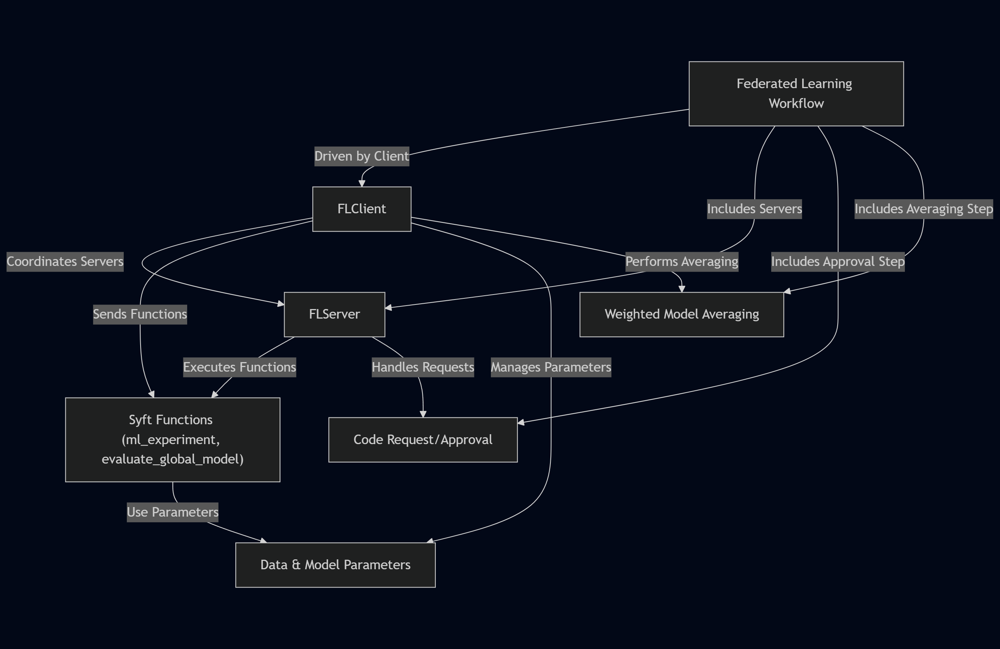
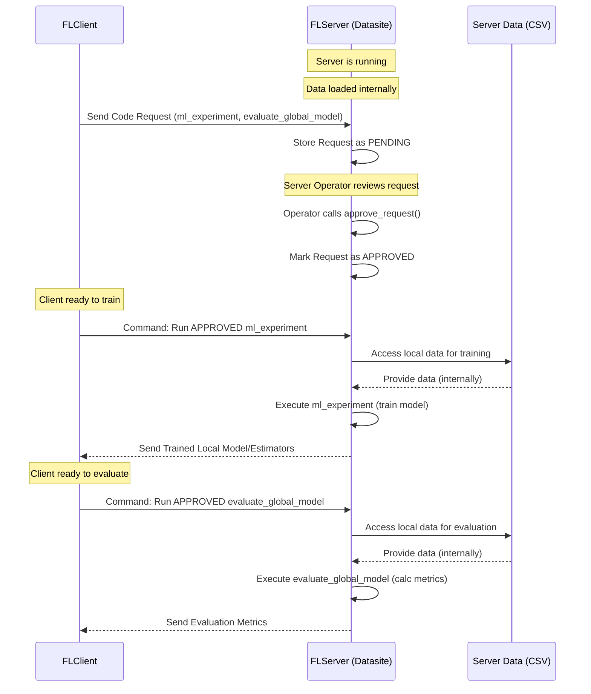

# Federated-learning-with-Random-Forests

## Visual Overview



## Chapters

1. [Federated Learning Workflow
](01_federated_learning_workflow_.md)
2. [FLClient
](02_flclient_.md)
3. [FLServer
](03_flserver_.md)
4. [Syft Functions (ml_experiment, evaluate_global_model)
](04_syft_functions__ml_experiment__evaluate_global_model__.md)
5. [Data & Model Parameters
](05_data___model_parameters_.md)
6. [Code Request/Approval
](06_code_request_approval_.md)
7. [Weighted Model Averaging
](07_weighted_model_averaging_.md)

---


# Chapter 1: Federated Learning Workflow

Welcome to the `fed_rf` tutorial! In this first chapter, we'll explore the complete journey of training a machine learning model using Federated Learning with this library. Think of it as the master plan or the recipe for a distributed project.

Imagine you have valuable data, like patient records in different hospitals, financial data in various banks, or sensor readings from devices spread across locations. You want to train a powerful machine learning model using *all* this data, but you absolutely *cannot* move the data from where it is due to privacy, security, or regulatory reasons.

This is where Federated Learning comes in! It allows multiple parties (like hospitals or banks) to collaboratively train a model without ever sharing their raw data. Instead, the training happens locally on their data, and only model updates or aggregated results are shared.

The `fed_rf` library helps you coordinate this process, specifically for Random Forest models. This chapter outlines the sequence of steps involved, like a multi-step project plan, to go from having distributed data to a collaboratively trained model.

Here is the overall workflow:

1.  **Launch Data Silos (Servers):** Set up the locations where the data resides and where training will happen.
2.  **Set Up the Federated Learning Client:** Initialize the central coordinator that manages the training process.
3.  **Configure Data and Model Parameters:** Define what data columns to use and how the model should be trained.
4.  **Send Requests to Servers:** The coordinator sends the training plan (code) to the data locations.
5.  **Approve Requests on Servers:** Each data location reviews and approves the plan before allowing it to run.
6.  **Run Federated Training:** The coordinator kicks off the training rounds across the approved data locations.
7.  **Evaluate the Federated Model:** Assess the performance of the final combined model.

Let's walk through each step using simple code examples from the README.

### Step 1: Launch Data Silos (Servers)

The "data silos" are essentially servers where your data lives. In the `fed_rf` world, these are instances of the `FLServer`. You'll typically have one server for each distinct dataset you want to use in training or evaluation.

```python
from fed_rf_mk.server import FLServer
import threading

# Server for the first dataset (silo1)
server1 = FLServer("silo1", 8080, "path/to/data1.csv", auto_accept=False)
server_thread1 = threading.Thread(target=server1.start, daemon=True)
server_thread1.start()

# Server for the second dataset (silo2)
server2 = FLServer("silo2", 8081, "path/to/data2.csv", auto_accept=False)
server_thread2 = threading.Thread(target=server2.start, daemon=True)
server_thread2.start()

# Server for evaluation data
server3 = FLServer("eval_silo", 8082, "path/to/eval_data.csv", auto_accept=False)
server_thread3 = threading.Thread(target=server3.start, daemon=True)
server_thread3.start()
```

In this step, we create `FLServer` objects, specifying a name, a port to listen on, and the path to the data file (a CSV in this case). We run them in separate threads so they can all run simultaneously, simulating different data locations. Setting `auto_accept=False` means the server operator must manually approve any incoming training requests, which is important for privacy (more on this in Step 5).

We'll learn more about the `FLServer` in [Chapter 3: FLServer](03_flserver_.md).

### Step 2: Set Up the Federated Learning Client

The `FLClient` acts as the central coordinator. It doesn't hold any data itself but connects to all the `FLServer` instances (which the client confusingly calls "clients" or "datasites") to orchestrate the federated process.

```python
from fed_rf_mk.client import FLClient

# Initialize the coordinator
fl_client = FLClient()

# Tell the coordinator about the training data silos
fl_client.add_train_client(
    name="silo1",
    url="http://localhost:8080",
    email="fedlearning@rf.com",
    password="your_password" # Replace with actual credentials
)
fl_client.add_train_client(
    name="silo2",
    url="http://localhost:8081",
    email="fedlearning@rf.com",
    password="your_password" # Replace with actual credentials
)

# Tell the coordinator about the evaluation data silo
fl_client.add_eval_client(
    name="eval_silo",
    url="http://localhost:8082",
    email="fedlearning@rf.com",
    password="your_password" # Replace with actual credentials
)
```

Here, we create the `FLClient` object and then use `add_train_client` and `add_eval_client` to register the servers we launched in Step 1. The `url`, `email`, and `password` are needed for the client to securely connect to each server using the underlying PySyft framework.

The `FLClient` is the focus of the next chapter: [Chapter 2: FLClient](02_flclient_.md).

### Step 3: Configure Data and Model Parameters

Before sending out the training task, the coordinator needs to specify *what* needs to be trained (the target column) and *how* the Random Forest model should be configured (number of trees, training split, etc.).

```python
# Define parameters for the data
data_params = {
    "target": "target_column",              # Name of the column we want to predict
    "ignored_columns": ["id", "timestamp"]  # Columns to ignore (e.g., identifiers)
}
fl_client.set_data_params(data_params)

# Define parameters for the model training
model_params = {
    "model": None,                  # Start without a pre-existing model
    "n_base_estimators": 100,       # How many trees in the first round
    "n_incremental_estimators": 10, # How many trees to add in later rounds
    "train_size": 0.8,              # Use 80% of local data for training
    "test_size": 0.2,               # Use 20% of local data for testing/validation
    "sample_size": None,            # Use all available samples
    "fl_epochs": 3                  # Run 3 rounds of federated learning
}
fl_client.set_model_params(model_params)
```

We define two dictionaries, `data_params` and `model_params`, containing all the necessary settings. The `FLClient` then stores these using `set_data_params` and `set_model_params`. These parameters will be sent to the servers along with the training code.

We will explore data and model parameters in more detail in [Chapter 5: Data & Model Parameters](05_data___model_parameters_.md).

### Step 4: Send Requests to Servers

Now that the client is set up and configured, it's time to send the "project plan" (the training and evaluation code) to the data silos.

```python
# Send the training and evaluation plan
fl_client.send_request()

# Check if the requests were successfully sent
fl_client.check_status_last_code_requests()
```

Calling `fl_client.send_request()` packages the necessary instructions (specifically, the Python functions `ml_experiment` for training and `evaluate_global_model` for evaluation) and sends them as "code requests" to all registered servers. The `check_status_last_code_requests()` call lets you verify that the requests were received by the servers.

The functions `ml_experiment` and `evaluate_global_model` are core components and will be covered in [Chapter 4: Syft Functions (ml_experiment, evaluate_global_model)](04_syft_functions__ml_experiment__evaluate_global_model__.md). The process of sending and checking these requests is part of [Chapter 6: Code Request/Approval](06_code_request_approval_.md).

### Step 5: Approve Requests on Servers

This is a crucial privacy and security step. The server operators (data owners) need to review the code request sent in Step 4. They want to ensure the code is safe, doesn't attempt to exfiltrate raw data, and performs the task as described. Only after explicit approval can the code run on their sensitive data.

```python
# On server1 (simulated)
print("Server 1: Checking pending requests...")
server1.list_pending_requests()  # Shows a list like: Request ID: 0, Status: PENDING
server1.inspect_request(0)       # Allows the operator to see the code and parameters
server1.approve_request(0)       # The operator approves request with ID 0

# On server2 (simulated)
print("Server 2: Approving request...")
server2.approve_request(0) # Assuming request ID is 0

# On server3 (evaluation server) (simulated)
print("Server 3: Approving request...")
server3.approve_request(0) # Assuming request ID is 0
```

Using `list_pending_requests()`, `inspect_request()`, and `approve_request()`, the server operator manually controls which code is allowed to run. This is why we set `auto_accept=False` when launching the servers.

The details of this approval process are covered in [Chapter 6: Code Request/Approval](06_code_request_approval_.md).

### Step 6: Run Federated Training

Once all the participating training servers have approved the code request, the client can initiate the actual federated training process.

```python
# Start the federated training rounds
fl_client.run_model()
```

Calling `fl_client.run_model()` orchestrates the training over several "epochs" or rounds (as defined in `model_params["fl_epochs"]`). In each round:

1.  The client sends the current global model (or instructions to build a new one in the first round) to each participating server.
2.  Each server runs the approved `ml_experiment` code locally on its own data.
3.  Each server sends back its trained model (or just the learned parameters/estimators) to the client.
4.  The client aggregates the models/estimators received from all servers into a new global model.

This cycle repeats for the specified number of epochs. The raw data *never* leaves the servers.

The aggregation process is a key part of Federated Learning, and `fed_rf` uses a specific method for Random Forests, which is explained in [Chapter 7: Weighted Model Averaging](07_weighted_model_averaging_.md).

### Step 7: Evaluate the Federated Model

After the training rounds are complete and the client has the final aggregated model, it's time to see how well it performs. This is typically done by sending the final model to an evaluation server that holds separate test data.

```python
# Run evaluation on the dedicated evaluation server
evaluation_results = fl_client.run_evaluate()
print(evaluation_results)
```

The `fl_client.run_evaluate()` method sends the final model to the server(s) designated for evaluation. These servers then run the approved `evaluate_global_model` code on their local test data and send back performance metrics (like accuracy, precision, etc.). The client then prints these results.

The `evaluate_global_model` function is part of [Chapter 4: Syft Functions (ml_experiment, evaluate_global_model)](04_syft_functions__ml_experiment__evaluate_global_model__.md).

### Putting it Together: A Simple Workflow Diagram

Here's a simplified view of the interaction flow described in the steps above:


This diagram shows how the `FLClient` orchestrates the process, sending code and commands, while the `FLServers` act on their local data and return only the necessary model components or results.

### Conclusion

In this chapter, we've seen the complete lifecycle of a federated learning task using `fed_rf`. It involves setting up the distributed data locations (`FLServer`), coordinating the process from a central point (`FLClient`), configuring the task, sending the necessary code for approval, executing the training rounds across the approved locations, and finally evaluating the resulting model.

This workflow ensures that sensitive data remains private while still allowing the collective intelligence of all data sources to contribute to a powerful shared model.

Now that we have a high-level understanding of the workflow, let's dive deeper into the main component responsible for coordinating everything: the `FLClient`.

[Next Chapter: FLClient](02_flclient_.md)

# Chapter 2: FLClient

Welcome back to the `fed_rf` tutorial! In the previous chapter, [Chapter 1: Federated Learning Workflow](01_federated_learning_workflow_.md), we got a bird's-eye view of the entire journey of training a Random Forest model using Federated Learning with `fed_rf`. We saw the major steps involved, from setting up data locations (servers) to getting the final evaluation results.

Now, let's zoom in on the central piece that makes all of this coordination possible: the `FLClient`.

### What is the FLClient?

Imagine the entire federated learning process as a grand orchestra, with different data silos (the servers we talked about in Chapter 1) being the musicians, each holding their unique instrument (their private data). The `FLClient` is the **conductor** of this orchestra.

The conductor doesn't touch any of the instruments or the sheet music held by individual musicians. Instead, the conductor has the *master score* (the overall training plan) and instructs the musicians *what* to play and *when* to play it. The conductor listens to the music produced by sections, perhaps guides them to play slightly differently, and ensures everyone plays together harmoniously to create a complete symphony (the final global model).

That's exactly what the `FLClient` does in `fed_rf`:

*   It's the main interface you interact with to start and manage the federated learning process.
*   It knows *which* data silos (servers) are participating.
*   It defines the *overall plan*: what data columns to use, what model settings to apply, and how many training rounds to run.
*   It sends *instructions* (in the form of secure code) to the data silos.
*   It orchestrates the *training rounds*, telling servers when to train and when to send back results.
*   It *combines* the results received from the servers (like merging the musical scores from different sections) to produce a better global model *without ever seeing the raw data*.

It's the brain that directs the collaborative learning effort across distributed, private datasets.

### Setting Up the Conductor: Initializing the FLClient

Your first step is always to create an instance of the `FLClient`. This is like picking up the conductor's baton.

```python
from fed_rf_mk.client import FLClient

# Create the conductor
fl_client = FLClient()
```

This simple line creates the `FLClient` object that you will use for all subsequent steps in the federated learning process. It doesn't need any special parameters when you initialize it.

### Telling the Conductor About the Musicians: Adding Data Silos

The conductor needs to know who is in the orchestra. In `fed_rf`, the `FLClient` needs to know which `FLServer` instances (data silos) it should connect to for training and evaluation. You add them using the `add_train_client` and `add_eval_client` methods.

These methods require the server's name, URL, and login credentials so the `FLClient` can securely connect using the underlying PySyft framework.

```python
# Add a training data silo
fl_client.add_train_client(
    name="silo1",
    url="http://localhost:8080", # Where the server is running
    email="fedlearning@rf.com",  # Login email
    password="your_password"     # Login password
)

# Add another training data silo
fl_client.add_train_client(
    name="silo2",
    url="http://localhost:8081",
    email="fedlearning@rf.com",
    password="your_password"
)

# Add an evaluation data silo
fl_client.add_eval_client(
    name="eval_silo",
    url="http://localhost:8082",
    email="fedlearning@rf.com",
    password="your_password"
)
```

Each call to `add_train_client` or `add_eval_client` establishes a secure connection from the `FLClient` to one specific `FLServer`. The `name` is just a label you use to refer to that server from the client side. Notice we are adding training servers and separate evaluation servers – this is common practice to ensure your model performs well on data it hasn't seen during training.

You can add as many training or evaluation clients as needed, corresponding to the `FLServer` instances you launched (as shown in Step 1 of the workflow in [Chapter 1: Federated Learning Workflow](01_federated_learning_workflow_.md)).

*(Note: The `weight` parameter in `add_train_client` is for advanced model aggregation and will be covered in [Chapter 7: Weighted Model Averaging](07_weighted_model_averaging_.md). For now, you can ignore it.)*

### Giving the Conductor the Score: Setting Data and Model Parameters

The conductor needs the master score before they can lead the orchestra. Similarly, the `FLClient` needs to know the details of the learning task: what data to use and how the model should be built and trained. This is done using `set_data_params` and `set_model_params`.

These methods take Python dictionaries containing the configuration details.

```python
# What data features/target to use
data_params = {
    "target": "outcome_column",      # Name of the column to predict
    "ignored_columns": ["id", "date"] # Columns to exclude (e.g., identifiers)
}
fl_client.set_data_params(data_params)

# How to train the Random Forest model
model_params = {
    "model": None,                  # No model yet, start from scratch
    "n_base_estimators": 50,        # Start with 50 trees in round 1
    "n_incremental_estimators": 5,  # Add 5 trees in each subsequent round
    "train_size": 0.75,             # Use 75% of local data for training
    "test_size": 0.25,              # Use 25% for local testing/validation
    "sample_size": None,            # Use all relevant rows
    "fl_epochs": 5                  # Run 5 federated learning rounds
}
fl_client.set_model_params(model_params)
```

By calling these methods, you're storing the learning configuration within the `FLClient`. This configuration will later be sent to the servers so they know exactly how to process their local data. We'll dive deeper into the meaning of each parameter in [Chapter 5: Data & Model Parameters](05_data___model_parameters_.md).

### Distributing the Music Sheets: Sending the Training Plan

Once the `FLClient` knows who the musicians are and has the score, it needs to distribute the music sheets (the code instructions) to the servers. In `fed_rf`, this is done by sending a "code request".

```python
# Send the plan (code requests) to all connected servers
fl_client.send_request()
```

Calling `send_request()` packages the predefined training and evaluation logic (`ml_experiment` and `evaluate_global_model`, which we'll explore in [Chapter 4: Syft Functions (ml_experiment, evaluate_global_model)](04_syft_functions__ml_experiment__evaluate_global_model__.md)), along with the `data_params` and `model_params`, and sends them securely to every `FLServer` that was added using `add_train_client` and `add_eval_client`.

After sending, you can check if the servers received the requests:

```python
# Check the status of the requests we just sent
fl_client.check_status_last_code_requests()
```

This method queries each server to see the status of the last code request sent by this client. It will typically show `PENDING` initially, waiting for the server operator's approval (which is covered in [Chapter 6: Code Request/Approval](06_code_request_approval_.md)).

### Conducting the Performance: Running the Federated Training

With the servers launched, connected, configured, and having approved the code request, the `FLClient` is ready to start the main performance – the federated training rounds.

```python
# Start the training symphony
fl_client.run_model()
```

This is where the real magic happens! Calling `run_model()` kicks off the iterative federated learning process defined by `model_params["fl_epochs"]`. Behind the scenes, for each epoch:

1.  The `FLClient` prepares the current global model (or instructions for the first round).
2.  It securely sends instructions to each *training* server to run the approved `ml_experiment` function using their local data and the current model/parameters.
3.  Each server executes `ml_experiment` locally. This function trains the model on the server's private data.
4.  Each server sends back its *updated model* (specifically, the new set of decision trees learned) to the `FLClient`. Crucially, the raw data *never* leaves the server.
5.  The `FLClient` collects the models/estimators from all participating servers.
6.  It aggregates these local contributions into a single, improved global model. `fed_rf` uses a weighted averaging method for this (see [Chapter 7: Weighted Model Averaging](07_weighted_model_averaging_.md)).
7.  This aggregated model becomes the starting point for the next epoch.

This process repeats for the specified number of `fl_epochs`. The `run_model()` call blocks (waits) until all epochs are complete.

### Applauding the Performance: Evaluating the Final Model

After the training rounds are finished and the `FLClient` has the final aggregated global model, the conductor needs to hear how well the complete symphony sounds. This is done by evaluating the model, typically on separate test data held by dedicated evaluation servers.

```python
# Evaluate the final model using the evaluation silos
evaluation_results = fl_client.run_evaluate()
print(evaluation_results)
```

The `run_evaluate()` method sends the final global model to the servers that were added using `add_eval_client`. These servers then execute the approved `evaluate_global_model` function locally on their test dataset. This function calculates standard machine learning metrics (like accuracy, precision, F1-score, etc.) without exposing the test data. The evaluation results are sent back to the `FLClient`, which then returns them to you.

### How the FLClient Works Under the Hood (Simplified)

Let's peek behind the curtain slightly, keeping it very beginner-friendly. The `FLClient` doesn't *do* the machine learning calculations itself. Its power comes from its ability to securely *communicate* and *orchestrate* tasks on the `FLServer`s using PySyft.

When you call methods like `run_model()` or `run_evaluate()`, the `FLClient` performs these high-level steps:

1.  **Serialization:** It takes the current global model object and the parameters (`data_params`, `model_params`) and converts them into a format that can be sent over the network (often using libraries like `pickle` or `cloudpickle`, as seen in the `client.py` and `server.py` files).
2.  **Remote Execution Request:** Using the connections established by `add_train_client` and `add_eval_client`, it sends a command to a specific server, telling it: "Run the previously approved `ml_experiment` (or `evaluate_global_model`) function using this data asset (`data=data_asset`) and these parameters (`dataParams=dataParams`, `modelParams=modelParams`)."
3.  **Waiting for Results:** The `FLClient` then waits for the server to finish executing the function.
4.  **Deserialization:** When the server sends back its result (e.g., a trained model object or evaluation metrics), the `FLClient` receives it and converts it back into usable Python objects.
5.  **Aggregation (for training):** If the result is a trained model from a training server, the `FLClient` collects these models from all participating training servers and combines them (aggregates them) into a new global model for the next round.

Here's a simplified flow for one training epoch:


This diagram shows that the `FLClient` directs the traffic but the actual computation on the data happens remotely on the servers.

Looking at the `fed_rf_mk/client.py` file, you'll see the `FLClient` class uses `syft.login` to connect to servers and then interacts with them using `datasite.code.function_name(...)`. This `datasite.code` part is how PySyft allows the client to securely call functions that were previously approved on the server.

For instance, inside `run_model()`, you see code like:

```python
# Simplified snippet from run_model
# This is where the client tells the server to run ml_experiment
modelParams = datasite.code.ml_experiment(
    data=data_asset,
    dataParams=dataParams,
    modelParams=modelParams
).get_from(datasite)
```

This line is the command from the conductor (`FLClient`) telling a specific musician (`datasite`, which represents an `FLServer`) to perform a specific piece of music (`ml_experiment`) using their instrument (`data_asset`) and the provided score details (`dataParams`, `modelParams`). The `.get_from(datasite)` part instructs PySyft to fetch the result back to the client.

Similarly, in `run_evaluate()`, the `FLClient` calls `evaluate_global_model` remotely:

```python
# Simplified snippet from run_evaluate
# Client tells the evaluation server to run the evaluation function
model = datasite.code.evaluate_global_model(
    data=data_asset, dataParams=dataParams, modelParams=modelParams
).get_from(datasite)
```

### Conclusion

The `FLClient` is your main control center for orchestrating federated learning in `fed_rf`. It's responsible for:

*   Connecting to the distributed data silos (`add_train_client`, `add_eval_client`).
*   Defining the learning task (`set_data_params`, `set_model_params`).
*   Sending the execution plan (the Syft Functions) to the servers (`send_request`).
*   Directing the training rounds (`run_model`).
*   Aggregating the results from servers (handled internally by `run_model`).
*   Initiating the final model evaluation (`run_evaluate`).

It does all of this without ever needing direct access to the sensitive data stored on the servers, truly acting as a privacy-preserving conductor for your distributed machine learning orchestra.

Now that we understand the conductor, let's look at the musicians – the `FLServer`s – in the next chapter.

# Chapter 3: FLServer

Welcome back! In the previous chapter, [Chapter 2: FLClient](02_flclient_.md), we learned about the `FLClient`, the "conductor" that orchestrates the federated learning process. It's the brain that tells everyone what to do.

Now, let's meet the other crucial players in our symphony: the `FLServer`s.

### What is the FLServer?

Imagine you're a chef with a secret family recipe and valuable ingredients in your kitchen. You want to participate in a cooking competition with other chefs, but you absolutely cannot let anyone else see your ingredients or your kitchen secrets. However, you *can* follow instructions (a recipe provided by the competition organizer) using your own ingredients in your own kitchen and send back the final dish (the baked cake, not the ingredients!).

In the `fed_rf` world, an `FLServer` is like that chef's secure kitchen.

*   It's a program that you run on a machine where your valuable, private data resides.
*   It acts as a guardian for your data.
*   It never shares the raw data with anyone, not even the `FLClient`.
*   It receives instructions (in the form of secure code called Syft Functions) from the `FLClient`.
*   It runs these instructions *locally* in its own secure environment, using its own data.
*   It sends *only* the results of the computation back to the `FLClient` (like sending the baked cake).

Think of each `FLServer` as a "data silo" or a "local expert" that can process information but keeps its raw knowledge private.

### Why Do We Need FLServers?

The core idea of Federated Learning is training models on distributed data without moving the data. `FLServer` is the component that makes this possible on the data owner's side. It provides a secure environment for executing computations on sensitive data under strict control.

For example, in a clinical trial scenario:
*   Each hospital runs an `FLServer` on their premises.
*   The `FLServer` holds the patient data for that specific hospital.
*   The `FLClient` (run by the research coordinator) sends the training plan.
*   The hospital's `FLServer` receives the plan, the hospital administrator reviews and approves it.
*   The `FLServer` executes the approved training code using its patients' data *locally*.
*   It sends back only the resulting model updates (e.g., the decision trees learned from that hospital's data).

This ensures patient data stays within the hospital's secure environment, respecting privacy regulations, while still contributing to a global model.

### Setting Up Your Data Kitchen: Creating an FLServer

To participate in federated learning, you need to launch an `FLServer` for each dataset you want to contribute (or evaluate on). This is like setting up your kitchen and getting it ready.

You create an `FLServer` instance by providing its name, the network port it should listen on, and the path to the CSV file containing its data.

```python
from fed_rf_mk.server import FLServer

# Create a server for "silo1" data on port 8080
# and tell it where its data is located.
server1 = FLServer(
    name="silo1",
    port=8080,
    data_path="path/to/data1.csv",
    auto_accept=False # We want to manually approve requests
)

# Create another server for "silo2" data on port 8081
server2 = FLServer(
    name="silo2",
    port=8081,
    data_path="path/to/data2.csv",
    auto_accept=False
)

# An evaluation server for test data on port 8082
server3 = FLServer(
    name="eval_silo",
    port=8082,
    data_path="path/to/eval_data.csv",
    auto_accept=False
)
```

When creating an `FLServer`, the key parameters are:
*   `name`: A unique identifier for this server (used by the client to refer to it).
*   `port`: A network port number where the server will listen for connections from the client.
*   `data_path`: The file path (on the server's machine) to the CSV data this server will use.
*   `auto_accept`: Controls whether the server automatically approves incoming code requests. For privacy and security, it's highly recommended to set this to `False` in a real scenario, requiring manual approval by the data owner.

### Opening Your Kitchen Doors: Starting the Server

Once you've configured the server object, you need to start it so it can begin listening for connections and requests from the `FLClient`.

```python
import threading

# Start server1 in a separate process/thread
server_thread1 = threading.Thread(target=server1.start, daemon=True)
server_thread1.start()

# Start server2 in a separate process/thread
server_thread2 = threading.Thread(target=server2.start, daemon=True)
server_thread2.start()

# Start server3 in a separate process/thread
server_thread3 = threading.Thread(target=server3.start, daemon=True)
server_thread3.start()

print("Servers are starting...")
# Keep the main program alive so daemon threads can run
# input("Press Enter to stop servers...\n") # Use this in a simple script
# For the tutorial context, assume they run in background threads
```

The `server.start()` method launches the server. Since you typically need multiple servers running simultaneously (simulating distributed data), we often run them in separate `threading.Thread` objects, as shown in the example from [Chapter 1: Federated Learning Workflow](01_federated_learning_workflow_.md). The `daemon=True` argument means these threads will stop automatically when the main program finishes.

Once started, the `FLServer` is running, listening on its specified port, and waiting for a `FLClient` to connect and send a request.

### Reviewing the Recipe: Approving Code Requests

Before the `FLServer` will perform any computation on its data, it must receive and approve a "code request" from the `FLClient`. This is a critical security step, like the chef reviewing the recipe from the organizer to ensure it's safe and doesn't ask for anything suspicious.

When the `FLClient` sends a request using `send_request()` (as seen in [Chapter 2: FLClient](02_flclient_.md) and [Chapter 1: Federated Learning Workflow](01_federated_learning_workflow_.md)), it arrives at the `FLServer` as a pending request. If `auto_accept` is `False`, the server operator needs to manually approve it.

Here's how the server operator interacts with the `FLServer` to manage requests:

```python
# On the machine running server1:

# 1. List pending requests
print("Checking for pending requests on server1...")
server1.list_pending_requests()
# Expected output (example):
# Pending requests:
# [0] Status: PENDING

# 2. Inspect a specific request (e.g., the first one, index 0)
print("\nInspecting request 0:")
request_code = server1.inspect_request(0)
print(request_code)
# This would print details about the code being requested to run,
# including the Syft Functions (ml_experiment, evaluate_global_model)
# and the parameters (data_params, model_params).

# 3. Approve the request
print("\nApproving request 0...")
server1.approve_request(0)
# Expected output (example):
# ✅ Approved request at index 0.
```

*   `list_pending_requests()`: Shows a list of requests that have been received but not yet approved or rejected. Each request has an index (like `[0]`, `[1]`, etc.) you can use to refer to it.
*   `inspect_request(request_index)`: Allows the server operator to view the actual code and parameters that the client wants to run on the server's data. This is crucial for verifying the request's safety and purpose.
*   `approve_request(request_index)`: Grants permission for the specific code request to be executed on the server's data. Once approved, the `FLClient` can trigger the execution of the requested functions remotely.
*   (There's also `reject_request(request_index)` to deny permission).

This manual approval step is key to the `fed_rf` and PySyft privacy model. Data owners retain control over *what* code is allowed to run on their sensitive data. This process is detailed further in [Chapter 6: Code Request/Approval](06_code_request_approval_.md).

### Running the Recipe: Executing Approved Code

Once the `FLServer` has approved the code request, the `FLClient` can then send commands to execute the functions included in that request (specifically, `ml_experiment` for training and `evaluate_global_model` for evaluation).

When the `FLClient` calls `run_model()` or `run_evaluate()`, it's telling the approved `FLServer`s: "Okay, run the `ml_experiment` (or `evaluate_global_model`) function you approved, using the data you have, and send me the result!"

The `FLServer` receives this command, looks up the approved code for the specified function, and executes it.

**Crucially:** The execution of the Syft Function (`ml_experiment` or `evaluate_global_model`) happens entirely *within the server's environment*, directly interacting with the server's local data file (`data_path`). The raw data never leaves the server. The result of this execution (like a trained model or evaluation metrics) is then sent back to the `FLClient`.

We'll explore the `ml_experiment` and `evaluate_global_model` functions themselves in the next chapter, [Chapter 4: Syft Functions (ml_experiment, evaluate_global_model)](04_syft_functions__ml_experiment__evaluate_global_model__.md).

### How the FLServer Works Under the Hood (Simplified)

Let's quickly revisit how the `FLServer` accomplishes this using PySyft, building on what we saw in [Chapter 2: FLClient](02_flclient_.md).

1.  **Launches a PySyft Datasite:** The `FLServer`'s `start()` method calls a helper function (`spawn_server` in `datasites.py`) which uses `syft.orchestra.launch` to start a PySyft Datasite instance. This Datasite *is* the secure environment running on the server's machine.
2.  **Loads Data:** The `spawn_server` function loads the data from the specified `data_path` (CSV) into a Pandas DataFrame and makes it available as a Syft `Asset` within the Datasite. This data asset is accessible only *locally* to code running *on* this Datasite.
3.  **Listens for Requests:** The Datasite continuously listens on its port for incoming connections and requests from PySyft clients (like our `FLClient`).
4.  **Receives and Stores Code Requests:** When the `FLClient` sends a code request, the Datasite receives the serialized Syft Functions (`ml_experiment`, `evaluate_global_model`) and associated parameters and stores them as pending requests.
5.  **Operator Interaction:** The `FLServer` class provides methods (`list_pending_requests`, `inspect_request`, `approve_request`) that allow the server operator to interact with the Datasite's stored requests.
6.  **Remote Function Execution:** Once a code request (containing functions like `ml_experiment`) is *approved* on the Datasite, PySyft allows the connected `FLClient` to *call* that function remotely. When the client does this (e.g., `datasite.code.ml_experiment(...)`), the Datasite executes the corresponding approved code locally.
7.  **Accesses Local Data:** Inside the executing function (e.g., `ml_experiment`), it can securely access the data asset stored locally on the Datasite.
8.  **Sends Results:** The function's return value (e.g., a trained model object, performance metrics) is serialized by PySyft and sent back to the `FLClient`.

Here's a simplified interaction flow focused on the server's role after it's running:



This diagram highlights that the data remains within the `FLServer`'s domain, and the server only sends back the *results* of the computations performed locally.

Looking at the `fed_rf_mk/server.py` file, you can see the `FLServer` class wraps the PySyft Datasite functionality. Methods like `list_pending_requests`, `inspect_request`, and `approve_request` are essentially wrappers around interacting with the underlying `self.client.requests` object provided by PySyft.

```python
# Snippet from server.py (simplified)
class FLServer:
    # ... __init__ and start methods ...

    def list_pending_requests(self):
        # Iterates through requests stored by the underlying PySyft client
        for idx, code in enumerate(self.client.code):
            if not code.status.approved:
                print(f"[{idx}] Status: {code.status.get_status_message()}")

    def approve_request(self, request_index: int):
        # Gets the request object from the PySyft client
        req = self.client.requests[request_index]
        # Calls PySyft's approve method
        req.approve(approve_nested=True)

    def inspect_request(self, request_index: int):
         # Gets the request object and returns its code attribute
         req = self.client.requests[request_index]
         return req.code
```

These snippets show how the `FLServer` class provides a convenient interface for the server operator to manage the requests handled by the underlying PySyft `client`.

### Conclusion

The `FLServer` is the privacy-preserving powerhouse of the `fed_rf` system. It securely holds private data, listens for instructions from the `FLClient`, allows the data owner to control which code runs on their data through an approval process, executes the approved code locally, and sends back only the results. It is the "kitchen" where the magic happens without ever revealing the sensitive "ingredients".

Now that we understand both the conductor (`FLClient`) and the musicians/kitchens (`FLServer`), let's dive into the "music sheets" or "recipes" – the Syft Functions (`ml_experiment` and `evaluate_global_model`) that contain the actual machine learning logic executed on the servers.
